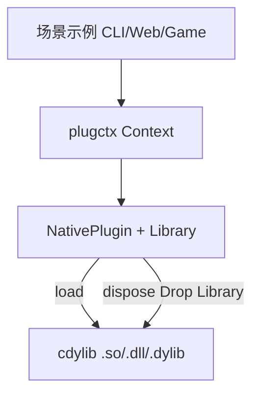

# Architecture Spine — plugctx 落地补齐

## Design Paradigm

既有分层：**默认同步内核**（`plugctx`，`default = []`）+ **Cargo feature 适配器**。本切片不引入新 crate 形态；热插拔改在 `dynamic-native` 适配器生命周期上。发布与 CI 是仓库操作面，不进运行时依赖图。



## Inherited Invariants

| Inherited | From parent | Binds here |
| --- | --- | --- |
| 空 `default` features；重运行时仅 `dep:` | 设计 §2.4 / NFR1 / FR52 | 示例不得把 extism/wasmtime 拉进 `plugctx` 默认图 |
| 不以 `abi_stable` 为基线；禁止跨 DSO `dyn Trait` | NFR6 / §4.3 | 热插拔仍走稳定 C ABI + `PLUGIN_ABI_VERSION` |
| WASM 卸载 = 实例 close/free | FR26 | 本切片不改 `dynamic-wasm` |
| `thread-safe` 与部分默认同步验收互斥 | feature-matrix | CI 禁止唯一 job 为 `--all-features` |
| 公开 crate 仅 `plugctx` / `plugctx-derive` | FR51 | 示例 `publish = false` |
| 0.y 能力清单 ≠ 强制 `version = 0.2.0` | FR54 | CHANGELOG 记 breaking 即可 |
| 核心 Error 单元变体 + `get` 返回 Option | api-freeze | 热插拔错误走已有 `Native*` / `AlreadyDisposed` 或新增**一个**可匹配变体，不恢复 TypeId 载荷大重构 |

## Invariants & Rules

### AD-1 — 废止 native FR25：卸载必物理释放

- **Binds:** FR-1, FR-2, FR-3, `dynamic-native`
- **Prevents:** dispose 后 `Library` 仍被 `ManuallyDrop` 按住，导致无法换新 `.so` / 旧代码仍可调用
- **Rule:** `NativePlugin` 在插件 scope 卸载完成（`PluginHandle::dispose` Ok 或 Context dispose 卸掉该条目）之后必须 Drop `libloading::Library`（不做 `ManuallyDrop` 泄漏）。逻辑卸载（撤销 provide/on/effect）仍先发生，然后物理卸载。WASM 路径不变。

### AD-2 — 失效 Invoker 不可调用

- **Binds:** FR-1
- **Prevents:** use-after-unmap 被当成成功
- **Rule:** `NativeInvoker` 在所属插件物理卸载后，`call` 必须返回 `Error`（可诊断）；禁止仍跳进旧 vtable。测试覆盖「dispose 后旧 invoker 失败」。

### AD-3 — 热插拔 = load → use → dispose → load，无强制 reload API

- **Binds:** FR-2
- **Prevents:** 为热插拔发明第二套生命周期
- **Rule:** 不新增 `reload()`，除非实现证明不先 Drop Library 就无法 `dlclose`（若新增必须写进 api-freeze）。覆盖同一路径时：先 dispose 再写文件再 load；文档写明 Windows 上文件锁定时须换路径或先 dispose。

### AD-4 — breaking 仅限 `dynamic-native` 卸载语义

- **Binds:** FR-3
- **Prevents:** 默认同步内核误标 breaking
- **Rule:** CHANGELOG / feature-matrix / README / requirements §4.3 同步改写；默认 features 测试不得依赖 `libloading`。

### AD-5 — 发布元数据

- **Binds:** FR-4, FR-5
- **Prevents:** publishing.md 与真实 origin 长期分叉
- **Rule:** workspace 或两公开 crate 设置 `repository = "https://github.com/TangCan/plugin-system"`。CI 继续 `ci-publish-dry-run.sh`。首次 crates.io 上传是维护者操作；故事交付清单与 dry-run 绿。

### AD-6 — GitHub Actions + clippy，矩阵而非 all-features

- **Binds:** FR-6, FR-7
- **Prevents:** 无托管 CI；clippy 缺席；`--all-features` 打红默认同步测试
- **Rule:** `.github/workflows/ci.yml` 在 ubuntu 上跑 `./scripts/ci-test.sh`。`ci-test.sh` 增加 clippy（`cargo clippy -p plugctx -- -D warnings` 及 derive；扩展 job 保持现有矩阵脚本）。不把 `cargo test --all-features` 当作唯一门槛。

### AD-7 — 用户指南落点

- **Binds:** FR-8
- **Prevents:** 指南散落在 requirements 里
- **Rule:** 新增 `docs/guide.md`；README 在「写一个插件」之前链入。指南必须包含 native 热插拔步骤与三条场景示例命令。

### AD-8 — 场景示例隔离依赖

- **Binds:** FR-9, FR-10, FR-11
- **Prevents:** 示例把 axum/游戏引擎塞进 `plugctx` 默认依赖
- **Rule:** 示例放在 `examples/`（`plugctx-examples`）或 `examples/apps/*` 且 `publish = false`。Web 用 **`tiny_http`**（同步、轻）。游戏用 **无引擎 tick 循环**（固定步数 + 插件改状态）。CLI 用 std + `plugctx`。native 演示走 `dynamic-native` feature。

## Consistency Conventions

| Concern | Convention |
| --- | --- |
| 文档语言 | 用户指南中文；代码标识符英文 |
| 错误 | 热插拔失败可 `match`；不 panic 作为控制流 |
| 平台库名 | Linux `lib{name}.so`，macOS `lib{name}.dylib`，Windows `{name}.dll` |
| CI | `set -euo pipefail`；失败非零退出 |
| 版本 | 不因本切片单独 bump 到 0.2.0 字符串 |

## Stack

| Name | Version |
| --- | --- |
| Rust edition | 2021 |
| libloading | workspace 0.8 |
| tiny_http | 钉 crates.io 兼容 0.12 线（实现时 lock） |
| GitHub Actions | ubuntu-latest + stable rust |

## Structural Seed

```text
plugin-system/
  .github/workflows/ci.yml
  docs/guide.md
  examples/
    cli-hotplug.rs      # 或 examples/apps/cli
    web-service.rs
    game-loop.rs
  crates/plugctx/src/dynamic_native.rs   # Drop Library
```

## Capability → Architecture Map

| Capability | Lives in | Governed by |
| --- | --- | --- |
| Native 物理卸载 / 再加载 | `dynamic_native.rs`，验收 `acceptance_story_4_2` 及后继 | AD-1, AD-2, AD-3 |
| 文档修订 FR25 | README, feature-matrix, requirements §4.3, CHANGELOG | AD-4 |
| repository / dry-run | Cargo.toml, publishing.md, ci-publish-dry-run.sh | AD-5 |
| GHA + clippy | `.github/workflows/ci.yml`, `scripts/ci-test.sh` | AD-6 |
| 用户指南 | `docs/guide.md` | AD-7 |
| CLI/Web/游戏示例 | `examples/` | AD-8 |

## Deferred

- Windows 托管 CI 矩阵（本地 cfg 仍要编过）。
- `reload()` 语法糖。
- release-plz / trusted publishing 全自动。
- ContextData 拆分（既有 ADR）。
- `buffer_unordered` 并发上限。
