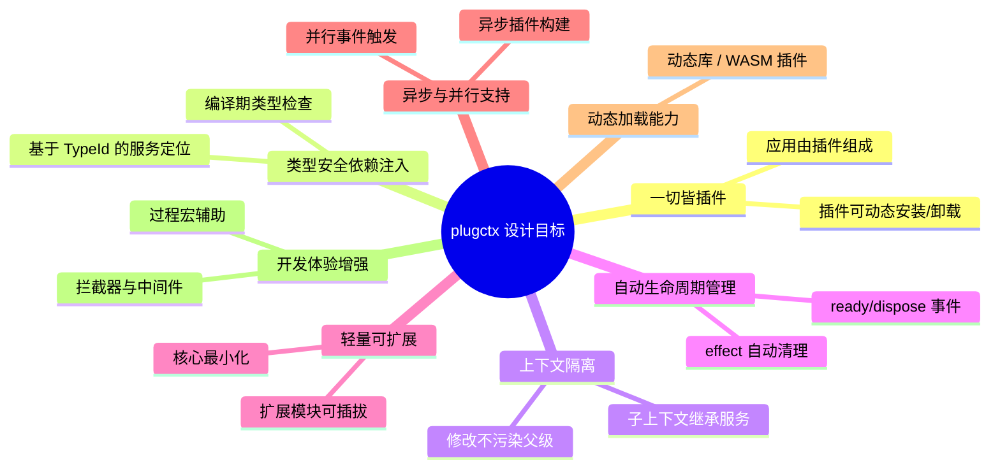
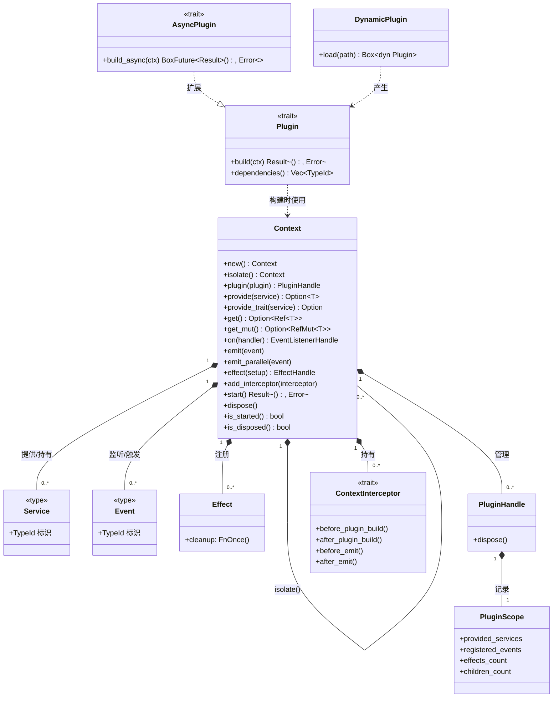
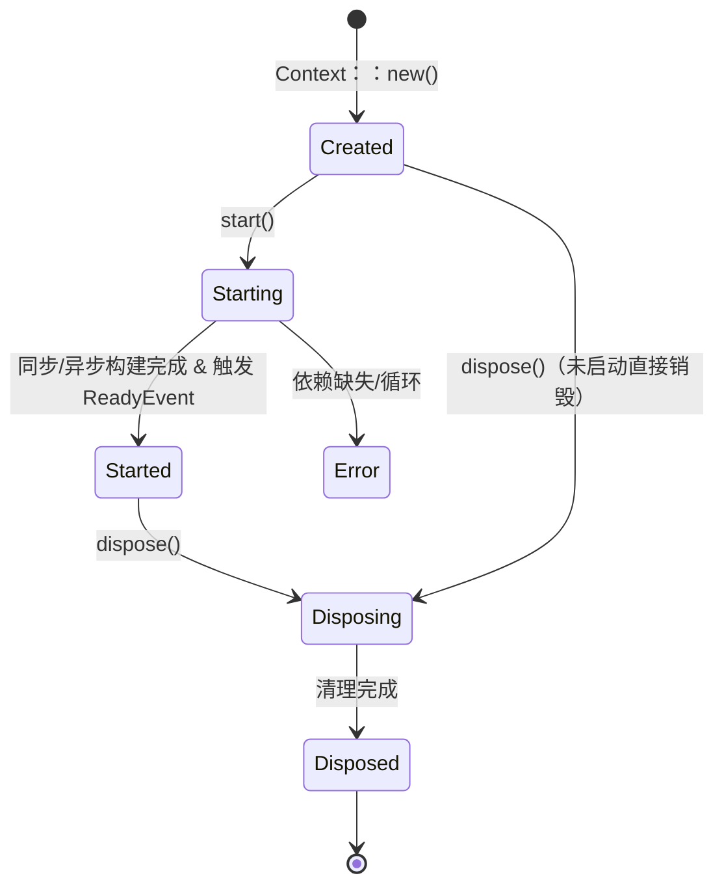
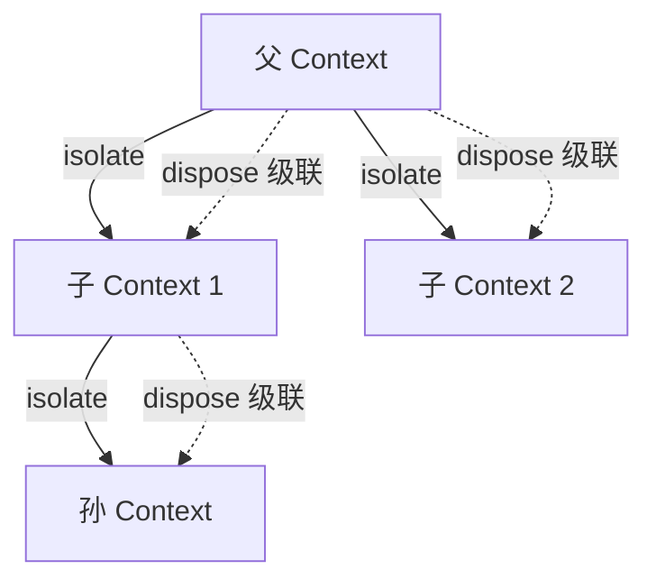

# 1. 引言

## 1. 引言

### 1.1 背景与问题

Rust 生态中缺乏一个轻量级、类型安全、以“一切皆插件”为核心设计理念的通用插件框架。现有方案要么过于重量级（如 Bevy 的 ECS 插件系统），要么只提供部分能力（如依赖注入容器或动态库加载），无法同时满足插件组合、依赖注入、上下文隔离、生命周期自动管理以及异步、并行、动态加载等扩展需求。

本项目（暂名 `plugctx`）旨在借鉴 Cordis（TypeScript）的设计哲学，结合 Rust 的所有权与类型系统优势，提供一个**轻量、可组合、可扩展**的插件框架，使开发者能够像搭积木一样构建应用，并可按需引入高级特性。

### 1.2 设计目标

框架的设计目标如下：

*   **一切皆插件**：应用的最小功能单元是插件，框架负责插件的组装与调度。
    
*   **类型安全的依赖注入**：插件通过声明依赖获取所需服务，框架基于 `TypeId` 自动解析，避免类型错误。
    
*   **上下文隔离**：每个 `Context` 是独立作用域，子上下文可继承父服务但修改互不影响。
    
*   **自动生命周期管理**：提供 `start()` 和 `dispose()` 全生命周期钩子，副作用通过 `effect` 自动清理，杜绝资源泄漏。
    
*   **轻量可扩展**：核心只包含最基础能力，通过扩展点支持异步、并行事件、动态加载等高级特性。
    
*   **异步与并行支持**：可选的异步插件构建和并行事件触发，满足高并发需求。
    
*   **动态加载能力**：支持从动态库或 WASM 加载外部插件，实现热插拔。
    
*   **开发体验增强**：通过过程宏减少样板代码，拦截器实现横切关注点。
    

### 1.3 设计原则

| 原则 | 说明 |
| --- | --- |
| **组合优于继承** | 插件通过组合方式协作，不依赖继承层次 |
| **显式优于隐式** | 依赖、副作用、事件监听均需显式声明 |
| **确定性清理** | 上下文或插件卸载时，所有资源必须被确定性地释放 |
| **最小惊讶** | 框架行为符合直觉，避免隐式全局状态 |
| **渐进式增强** | 核心保持最小，高级功能通过扩展实现，按需启用 |
| **开放封闭** | 核心对扩展开放，对修改封闭；通过 trait 和 feature 扩展 |

### 1.4 核心概念与术语

以下是框架的核心概念及其关系，包括扩展模块引入的概念：

*   **Context（上下文）**：插件的运行环境，负责服务、事件、副作用、子上下文和拦截器的统一管理。
    
*   **Plugin（插件）**：实现 `Plugin` trait 的功能单元，通过 `build` 方法访问上下文。
    
*   **AsyncPlugin（异步插件）**：`Plugin` 的异步扩展，支持异步构建。
    
*   **Service（服务）**：可共享的任意 Rust 类型（含 trait 对象），以 `TypeId` 为唯一键。
    
*   **Event（事件）**：类型化消息，用于插件间通信。
    
*   **Effect（副作用清理器）**：上下文销毁时自动执行的清理闭包。
    
*   **PluginScope（插件作用域）**：记录单个插件构建期间产生的所有注册信息，用于精确卸载。
    
*   **PluginHandle（插件句柄）**：插件安装后返回的控制器，可调用 `dispose()` 卸载插件。
    
*   **ContextInterceptor（上下文拦截器）**：可插入到关键操作前后的中间件钩子。
    
*   **DynamicPlugin（动态插件）**：从外部动态加载的插件包装。
    

**生命周期状态转换**（包括异步构建和动态加载阶段）：

**上下文隔离与级联销毁**：

以上概念共同构成了 `plugctx` 的基础。框架设计上保持核心最小，通过可选 feature 和独立 crate 逐步引入扩展能力，兼顾轻量与功能完整性。后续章节将详细阐述各组件的设计与实现。