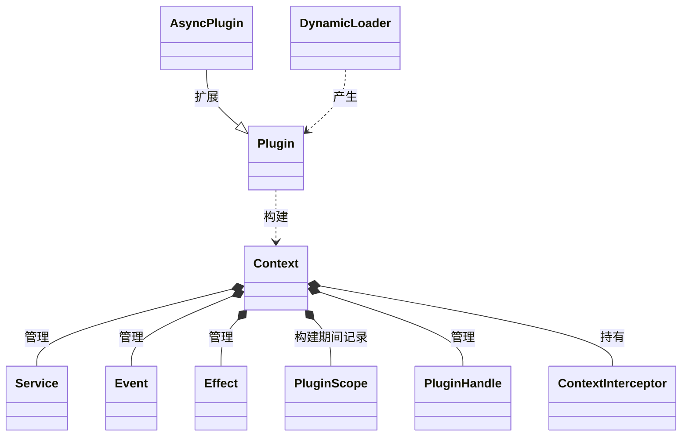
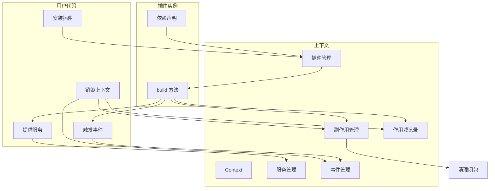
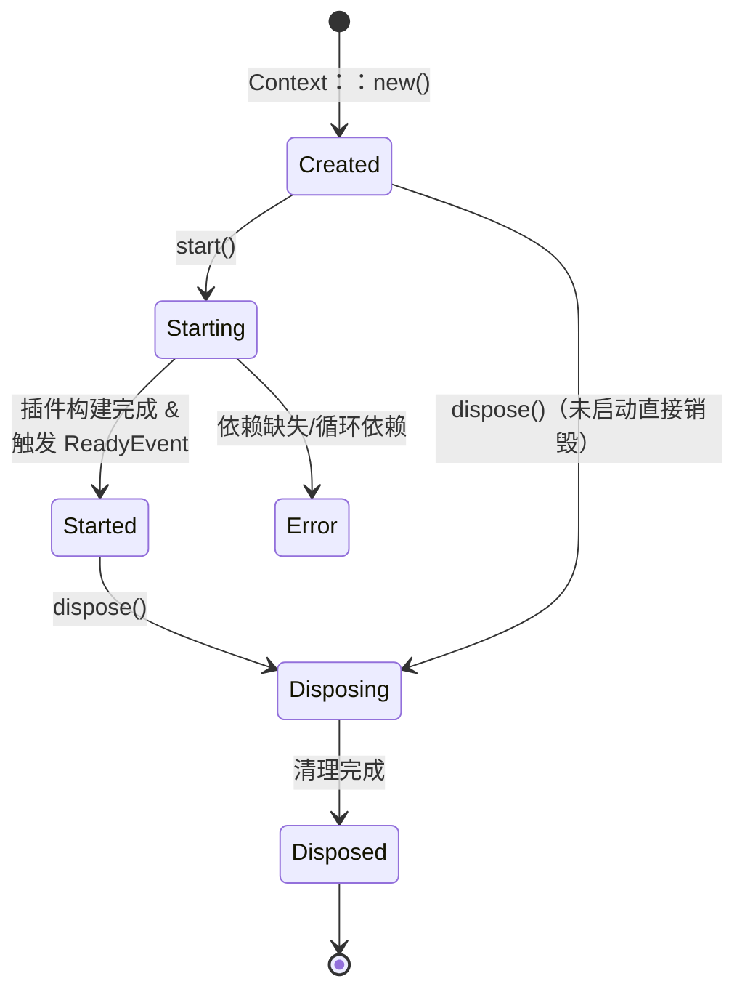
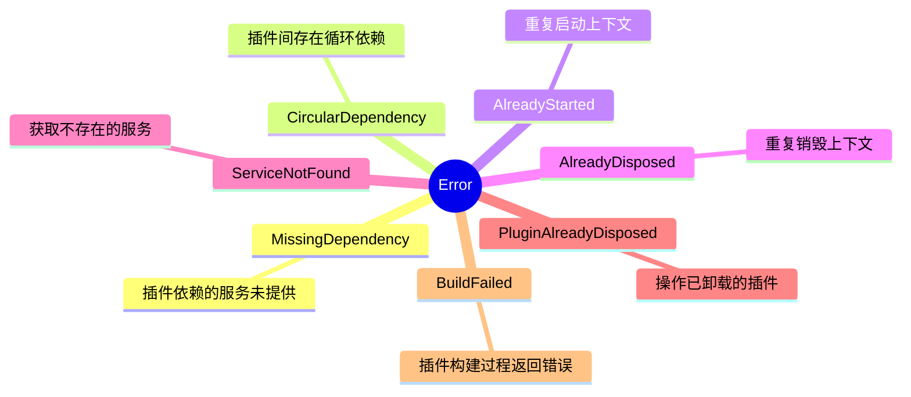
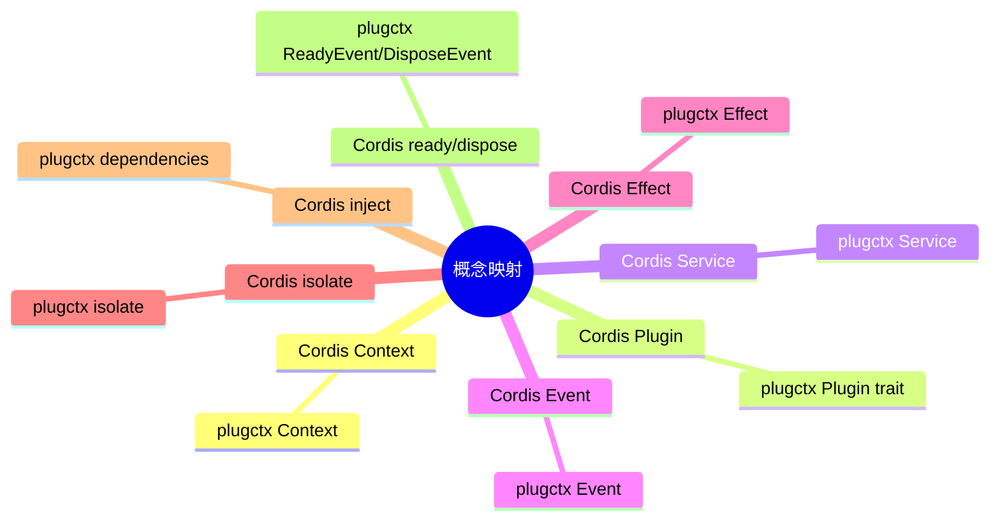

# 10. 附录

## 10. 附录

本附录汇总了 `plugctx` 框架的核心术语、概念关系、生命周期状态、错误分类以及与其他框架的概念映射，作为正文的补充参考。

### 10.1 核心术语表

以下术语在框架文档中频繁出现，特此集中解释。

| 术语 | 英文 | 说明 |
| --- | --- | --- |
| 上下文 | Context | 插件的运行环境，管理服务、事件、副作用和子上下文 |
| 插件 | Plugin | 实现 `Plugin` trait 的最小功能单元 |
| 服务 | Service | 可在插件间共享的任意 Rust 类型（含 trait 对象） |
| 事件 | Event | 类型化消息，用于插件间通信 |
| 副作用清理器 | Effect | 上下文销毁时自动执行的清理闭包 |
| 插件作用域 | Plugin Scope | 记录插件构建期间所有注册信息，用于精确卸载 |
| 隔离 | Isolate | 创建子上下文，修改不影响父上下文 |
| 依赖注入 | Dependency Injection | 通过声明依赖自动获取所需服务 |
| 拦截器 | Interceptor | 在关键操作前后插入的钩子 |
| 异步插件 | Async Plugin | 支持异步构建的插件扩展 |
| 并行事件 | Parallel Emit | 并发执行事件监听器的扩展能力 |
| 动态加载 | Dynamic Loading | 运行时从外部文件加载插件的能力 |
| 多线程支持 | Thread-safe | 使上下文跨线程共享的能力 |
| 过程宏 | Derive Macro | 自动生成插件实现代码的宏 |

对应的类型关系：

### 10.2 核心交互概览

以下流程图展示了插件、上下文、服务、事件和副作用之间的核心交互关系。

### 10.3 生命周期状态转换

上下文生命周期包括创建、启动、运行和销毁四个阶段，每个阶段有明确的状态和触发条件。

### 10.4 错误类型分类

框架统一的错误类型涵盖依赖缺失、循环依赖、状态错误和服务未找到等情况。

### 10.5 与 Cordis 概念映射

`plugctx` 的设计借鉴了 Cordis（TypeScript 插件框架），两者核心概念具有对应关系。

对应关系说明：

*   **上下文**：两者均以 `Context` 为插件运行环境，提供插件安装、服务管理、事件注册等能力。
    
*   **插件**：Cordis 中插件可以是函数或对象，`plugctx` 中通过 `Plugin` trait 统一抽象。
    
*   **服务**：Cordis 通过 `provide` 提供服务，`plugctx` 的 `provide`/`provide_trait` 类似，但类型系统更强。
    
*   **事件**：两者均支持类型化事件，`emit` 触发监听器。
    
*   **副作用**：`effect` 注册清理闭包，销毁时自动执行。
    
*   **隔离**：`isolate` 创建子上下文，继承服务但修改隔离。
    
*   **依赖注入**：Cordis 通过 `inject` 声明依赖，`plugctx` 通过 `dependencies()` 返回 `TypeId` 列表。
    
*   **生命周期**：`ready`/`dispose` 事件在两者中均存在，触发时机一致。
    

### 10.6 参考资料

以下资料为框架设计提供了重要参考：

1.  **Cordis 框架文档**[https://cordis.js.org](https://cordis.js.org)   TypeScript 插件框架，本项目的设计灵感来源。
    
2.  **Bevy 插件系统**[https://bevyengine.org/learn/book/plugin-system/](https://bevyengine.org/learn/book/plugin-system/)   Rust 游戏引擎的插件架构，提供了生命周期和依赖注入的参考。
    
3.  **Rust 标准库** `**Any**` **和** `**TypeId**`[https://doc.rust-lang.org/std/any/](https://doc.rust-lang.org/std/any/)   类型擦除和动态类型标识的基础。
    
4.  `**async-trait**` **crate**[https://docs.rs/async-trait](https://docs.rs/async-trait)   异步 trait 方法支持。
    
5.  `**libloading**` **crate**[https://docs.rs/libloading](https://docs.rs/libloading)   动态库加载。
    
6.  `**wasmtime**` **crate**[https://docs.rs/wasmtime](https://docs.rs/wasmtime)   WASM 运行时。
    
7.  `**thiserror**` **crate**[https://docs.rs/thiserror](https://docs.rs/thiserror)   错误派生宏。
    
8.  `**slotmap**` **crate**[https://docs.rs/slotmap](https://docs.rs/slotmap)   稳定 ID 容器。
    
9.  `**tracing**` **crate**[https://docs.rs/tracing](https://docs.rs/tracing)   结构化日志门面。
    
10.  `**proptest**` **crate**[https://docs.rs/proptest](https://docs.rs/proptest)   属性测试框架。
    

以上参考资料与依赖共同支撑了框架的设计与实现。