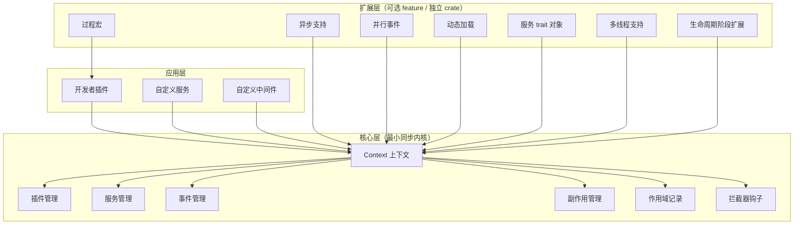
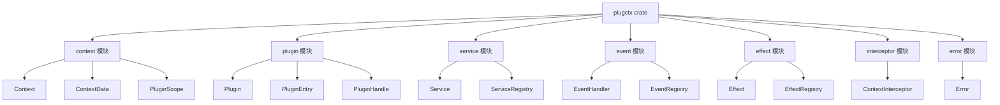
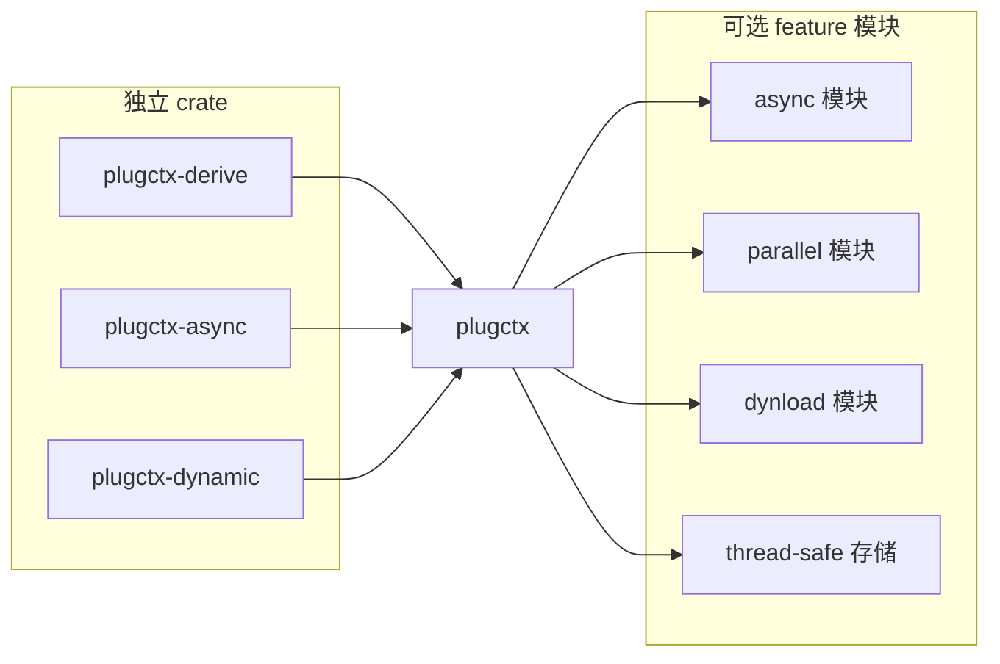
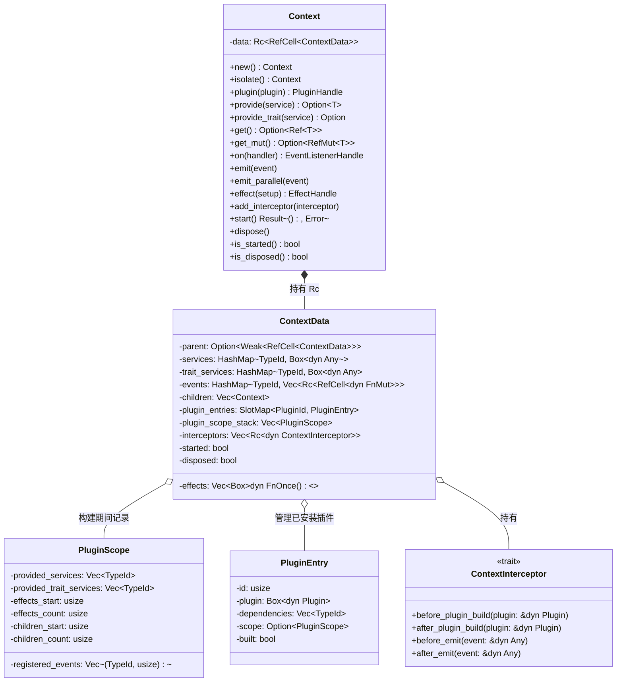
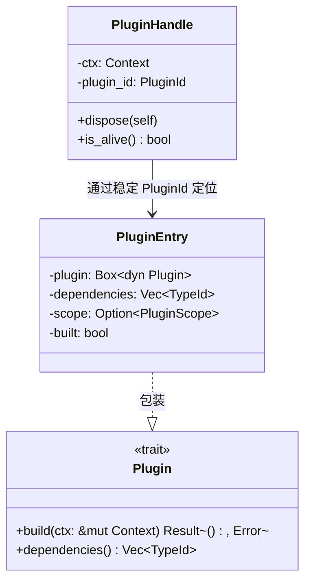
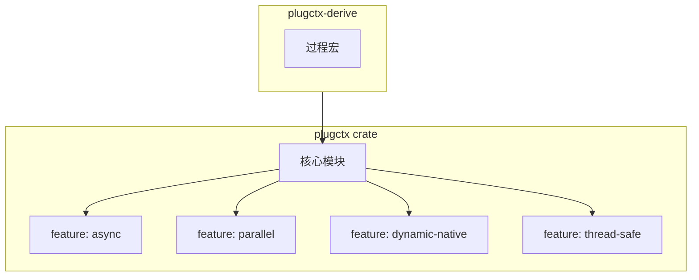

# 2. 总体架构

## 2. 总体架构

### 2.1 架构概述

`plugctx` 采用**分层 + 可插拔扩展**的架构。核心层提供最小同步内核，负责插件管理、服务解析、事件分发、副作用清理和上下文隔离。扩展层通过 feature 开关或独立 crate 提供异步、并行事件、动态加载、过程宏等高级能力，不强制引入。

*   **核心层**：不依赖任何异步运行时，仅使用标准库和少量轻量 crate，提供插件运行时的基础能力。
    
*   **扩展层**：按需启用，通过 Cargo features 或独立 crate（如 `plugctx-async`、`plugctx-dynamic`）集成，不影响核心的简洁性。
    
*   **应用层**：最终用户编写的插件和服务，只需与 `Context` 交互，无需关心内部实现。
    

### 2.2 模块划分

项目按职责拆分为核心模块与扩展模块，核心模块组成 `plugctx` crate 的主体，扩展模块通过 feature 或独立 crate 提供。

#### 2.2.1 核心模块

*   **context**：定义 `Context`、`ContextData`、`PluginScope`，是框架的中枢。
    
*   **plugin**：定义 `Plugin` trait、`PluginEntry`（内部表示）和 `PluginHandle`。
    
*   **service**：管理服务注册表，支持具体类型和 trait 对象。
    
*   **event**：管理事件监听器注册表，支持类型化事件分发。
    
*   **effect**：管理副作用清理器，保证逆序执行。
    
*   **interceptor**：定义拦截器 trait，提供插件构建和事件触发的前后钩子。
    
*   **error**：统一错误类型。
    

#### 2.2.2 扩展模块

*   **async 模块**：通过 `feature = "async"` 启用，提供 `AsyncPlugin` trait 和异步构建支持。
    
*   **parallel 模块**：通过 `feature = "parallel"` 启用，提供 `emit_parallel` 方法。
    
*   **dynload 模块**：通过 `feature = "dynamic-native"` 启用原生动态库（C ABI）；通过 `feature = "dynamic-wasm"` 启用 WASM 实例路径（**Extism** 真实引擎；仅可选 feature 依赖，不进默认依赖图）。
    
*   **thread-safe**：通过 `feature = "thread-safe"` 切换内部存储为 `Arc<RwLock>`。
    
*   **独立 crate**：过程宏（`plugctx-derive`）等可作为独立 crate 发布，减少核心依赖。
    

### 2.3 核心数据结构

#### 2.3.1 上下文核心数据

`Context` 对外表现为轻量句柄，内部通过 `Rc<RefCell<ContextData>>`（或多线程版本 `Arc<RwLock<ContextData>>`）共享可变状态。`ContextData` 保存上下文的全部运行信息。

**字段说明**：

| 字段 | 类型 | 用途 |
| --- | --- | --- |
| `parent` | `Option<Weak<RefCell<ContextData>>>` | 指向父上下文，用于服务继承；弱引用避免循环 |
| `services` | `HashMap<TypeId, Box<dyn Any>>` | 具体类型服务注册表 |
| `trait_services` | `HashMap<TypeId, Box<dyn Any>>` | trait 对象服务注册表（键为 trait 的 `TypeId`） |
| `events` | `HashMap<TypeId, Vec<Rc<RefCell<dyn FnMut>>>>` | 事件监听器表，使用 `Rc<RefCell>` 包装避免重入冲突 |
| `effects` | `Vec<Box<dyn FnOnce()>>` | 副作用清理器，销毁时逆序调用 |
| `children` | `Vec<Context>` | 子上下文列表，用于级联销毁 |
| `plugin_entries` | `SlotMap<PluginId, PluginEntry>` | 已安装插件列表（可能未构建）；稳定键定位 |
| `plugin_scope_stack` | `Vec<PluginScope>` | 当前正在构建的插件作用域栈，用于记录注册操作 |
| `interceptors` | `Vec<Rc<dyn ContextInterceptor>>` | 拦截器列表，在关键操作前后调用（快照后可重入） |
| `started` | `bool` | 标记上下文是否已启动 |
| `disposed` | `bool` | 标记上下文是否已销毁 |

#### 2.3.2 插件内部表示

*   `PluginEntry` 是 `ContextData` 内部存储的插件实例，包含插件对象、依赖列表和构建时作用域；容器为 `slotmap::SlotMap`（设计 §7.4）。
    
*   `PluginHandle` 是用户持有的控制器，只记录稳定插件 ID 和上下文引用，调用 `dispose()` 时触发精确卸载。
    

### 2.4 可插拔扩展架构

扩展能力通过 Cargo features 和独立 crate 实现，按需引入。核心 crate 提供稳定的 API 接口，扩展模块围绕核心构建。

**Feature 划分**：

| Feature | 描述 | 额外依赖 |
| --- | --- | --- |
| `async` | 启用异步插件构建和异步生命周期事件 | `async-trait`、`futures` |
| `parallel` | 启用宿主侧并行事件（`on_async` / `emit_parallel`）；依赖 `async` | 复用 `futures`（无 rayon） |
| `dynamic-native` | 启用原生动态库加载（稳定 C ABI + `libloading`）；dispose 后 Drop `Library`（`dlclose`）；`PLUGIN_ABI_VERSION` 协商 | `libloading`、`plugin-api` |
| `dynamic-wasm` | WASM 实例加载（**Extism**）+ **显式 close/free**（FR26）；`WASM_ABI_VERSION` 协商 | `extism`（仅本 feature） |
| `thread-safe` | 使用 `Arc<parking_lot::RwLock>` 替代 `Rc<RefCell>`，支持跨线程；`Send+Sync` 约束 | `parking_lot`（optional） |

**扩展 crate**：

*   `plugctx-derive`：提供 `#[derive(Plugin)]` 等过程宏，通过 `#[plugin(depends(...))]` 自动生成依赖列表，并将 `build` 委托到 `on_build`；核心 crate 不依赖本宏 crate。
    
*   后续可继续扩展引擎后端；**不以 `abi_stable` 为基线**。动态适配器已接入同一 `Context` 生命周期，并完成 native/wasm ABI 版本协商（Story 4.4）与统一 `DynamicLoader` 入口（Story 4.5）。
    

通过这种设计，核心保持轻量，用户可以根据需要启用扩展功能，避免强制引入不必要的依赖。未来还可以添加新的扩展 crate，而不影响核心稳定性。

以上是总体架构的详细说明，后续章节将深入每个组件的具体实现。