# 3. 核心组件设计

## 3. 核心组件设计

本章详细描述 `plugctx` 核心组件的内部设计与实现，包括上下文、插件管理、服务与依赖注入、事件系统、副作用清理、插件作用域、上下文隔离、生命周期管理和拦截器钩子。

### 3.1 Context（上下文）

`Context` 是框架的核心入口，对外表现为轻量句柄，内部持有 `Rc<RefCell<ContextData>>` 共享可变状态。开发者通过 `Context` 完成插件安装、服务提供/获取、事件监听/触发、副作用注册以及生命周期控制。

#### 3.1.1 结构与字段

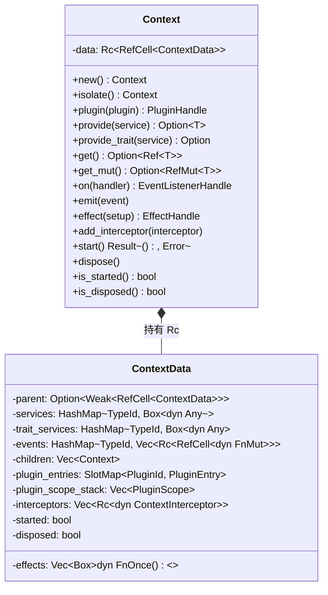

**设计要点**：

*   `parent` 使用 `Weak` 引用，避免父子上下文之间形成循环引用导致内存泄漏。
    
*   `services` 存储具体类型服务，键为服务类型的 `TypeId`。
    
*   `trait_services` 存储 trait 对象服务，键为 trait 的 `TypeId`，允许同一 trait 的多个实现共存（需不同 trait 类型）。
    
*   `events` 使用 `Rc<RefCell<dyn FnMut>>` 包装监听器，解决重入时借用冲突（见 3.4.3）。
    
*   `effects` 存储清理闭包，销毁时逆序执行。
    
*   `children` 保存所有子上下文，用于级联销毁。
    
*   `plugin_entries` 保存已安装插件（可能未构建），记录其依赖和构建状态。
    
*   `plugin_scope_stack` 用于插件构建期间自动捕获注册操作。
    
*   `interceptors` 保存拦截器，在插件构建和事件触发前后调用。
    

#### 3.1.2 内部可变性与重入处理

由于 `Context` 的多个操作（如 `emit` 调用监听器时，监听器内部可能再次调用 `ctx` 方法）需要在运行时共享可变状态，框架采用 `RefCell` 提供内部可变性。同时，事件监听器使用 `Rc<RefCell<dyn FnMut>>` 避免 `borrow` 冲突（详见 3.4.3）。

**局限性**：`Rc<RefCell<...>>` 不是 `Send + Sync`，因此默认版本仅支持单线程环境。若需多线程支持，可通过 `thread-safe` feature 切换为 `Arc<parking_lot::RwLock<...>>`，并要求服务/插件/监听器实现 `Send + Sync`（见 §4.6）。

### 3.2 Plugin trait 与插件管理

#### 3.2.1 Plugin trait 定义

```rust
pub trait Plugin {
    /// 构建插件，在插件被安装或上下文启动时调用。
    fn build(&self, ctx: &mut Context) -> Result<(), Error>;

    /// 声明此插件依赖的服务类型。
    fn dependencies(&self) -> Vec<TypeId> {

        vec![]

    }
}

```

*   `build` 方法在插件被构建时调用，负责注册服务、监听事件、创建副作用和子上下文。
    
*   `dependencies` 声明该插件依赖的服务类型集合（`TypeId` 列表），框架据此进行依赖排序，确保依赖的服务在 `build` 前已提供。
    

#### 3.2.2 插件内部表示

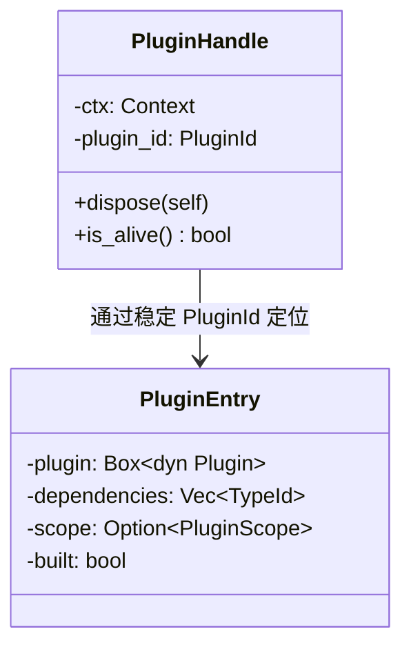

*   `PluginEntry` 存储在 `ContextData.plugin_entries`（`slotmap::SlotMap`）中，包含插件对象本身、其依赖列表、构建时记录的作用域（若有）以及构建状态。
    
*   `PluginHandle` 是用户持有的控制器，仅包含上下文引用和稳定插件 ID（`PluginId`），调用 `dispose()` 时触发精确卸载（见 3.6）；条目删除后旧键失效，不会误指新安装的插件。
    
*   `built` 标记插件是否已执行 `build`；已构建的插件会有 `scope` 记录，未构建的插件 `scope` 为 `None`。
    

#### 3.2.3 插件安装流程

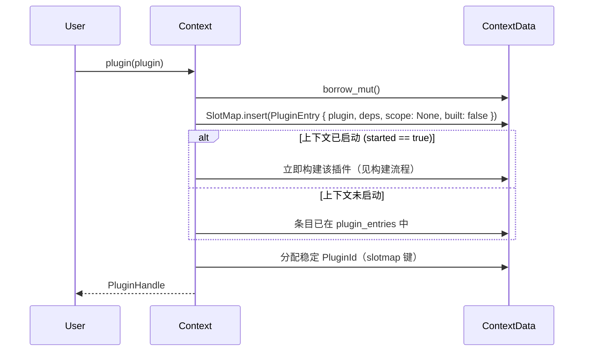

**说明**：

*   安装插件时若上下文已启动，则立即调用 `build`；否则延迟到 `start()` 时统一构建。
    
*   插件 ID 由 `slotmap` 分配稳定键；删除后旧键失效，避免自增计数器误用。
    

#### 3.2.4 插件构建流程（延迟启动时）

`Context::start()` 会触发所有未构建插件的构建：

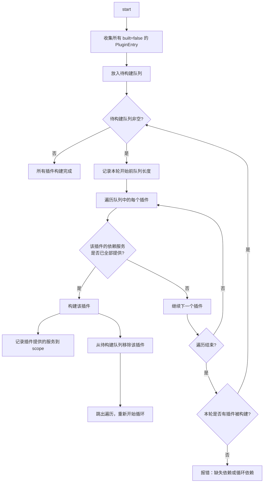

**拓扑排序**：采用乐观构建 + 循环尝试策略。插件在 `build` 中调用 `provide` 时，会记录“该插件提供了哪些服务类型”到 `PluginScope`。构建循环检查每个插件的依赖是否已满足，若满足则构建，并可能在构建后提供新服务，解锁其他插件。若一轮中无插件被构建，则报错（缺失依赖或循环依赖）。

### 3.3 服务与依赖注入

#### 3.3.1 服务提供与获取

服务是插件间共享的任意 Rust 类型。框架提供两种服务注册方式：

1.  **具体类型服务**：使用 `provide::<T>()` 注册类型为 `T` 的实例。
    
2.  **trait 对象服务**：使用 `provide_trait::<dyn Trait>(Box<dyn Trait>)` 注册 trait 对象，键为 trait 的 `TypeId`，存于独立 `trait_services` 表（与具体类型 `services` 隔离）。
    

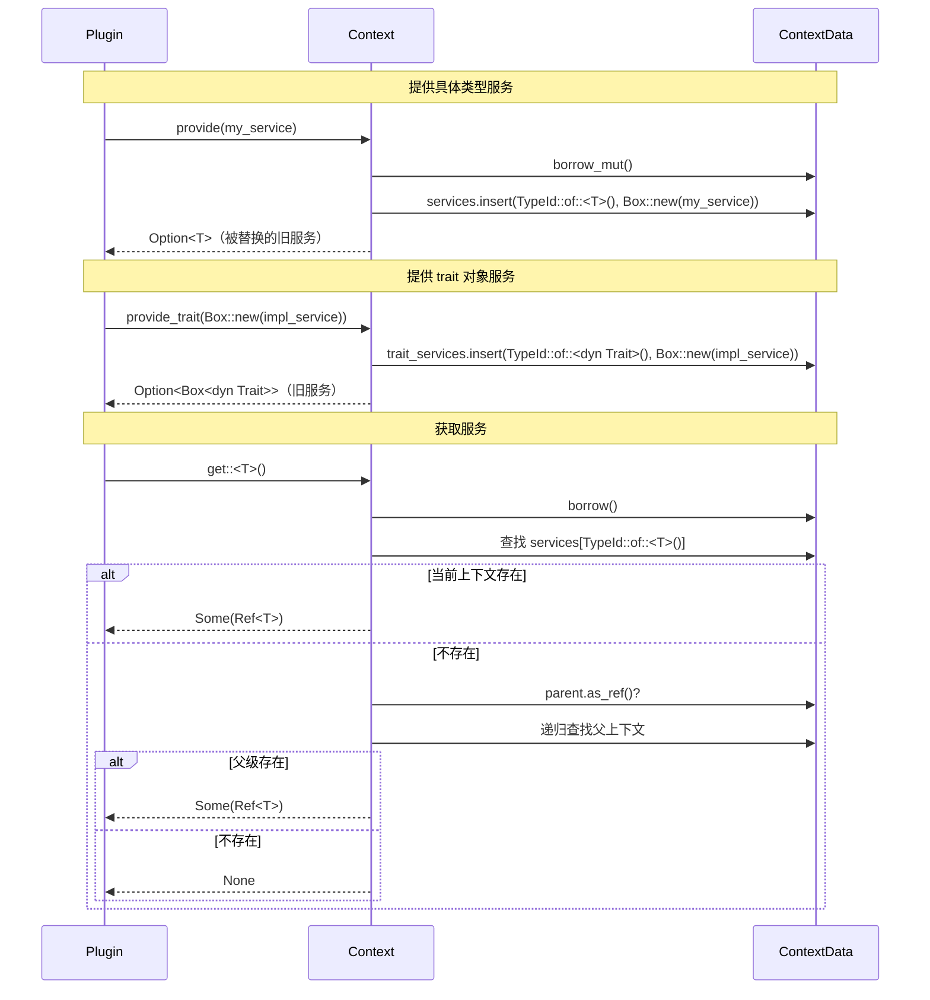

**关键点**：

*   `provide` 返回被覆盖的旧服务（若有），便于调用者处理。
    
*   `get` 返回 `Ref<T>`（`std::cell::Ref`），确保借用安全。
    
*   `get_mut` 返回 `RefMut<T>`，允许修改服务。
    
*   子上下文可以提供与父上下文同名的服务，实现覆盖；父上下文不受影响。
    
*   trait 对象服务的获取：`get_trait::<dyn Trait>() -> Option<Ref<dyn Trait>>`，类似 `get`，但通过 trait 的 `TypeId` 查找。
    

#### 3.3.2 类型擦除与恢复

服务存储为 `Box<dyn Any>`，获取时通过 `downcast_ref::<T>()` 恢复。对于 trait 对象服务，`Box<dyn Any>` 中存储的是 `Box<dyn Trait>`，需要先 `downcast_ref::<Box<dyn Trait>>()` 再解引用。框架内部封装了这些操作，提供类型安全的 API。

### 3.4 事件系统

事件系统提供类型化、同步的事件分发机制，监听器在上下文销毁时自动移除。

#### 3.4.1 事件注册与触发

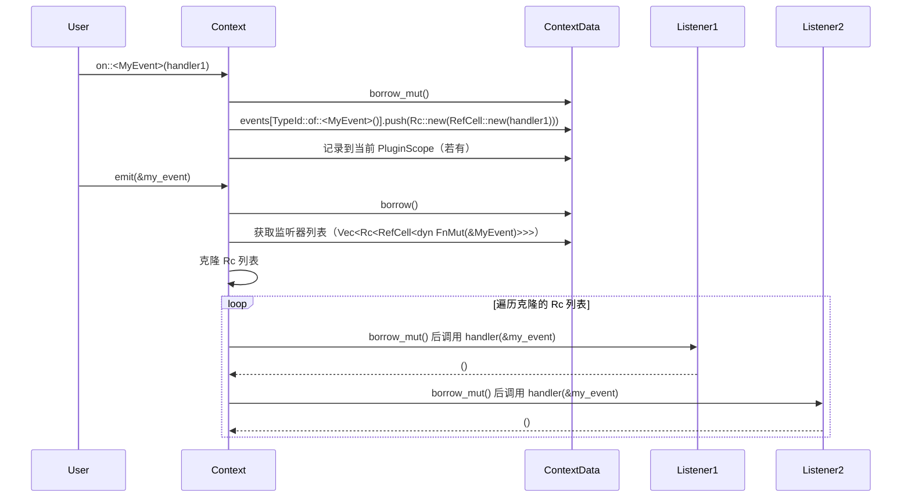

#### 3.4.2 存储结构

```rust
events: HashMap<TypeId, Vec<Rc<RefCell<dyn FnMut(&E)>>>>,

```

每个事件类型 `E` 对应一个 `Vec<Rc<RefCell<dyn FnMut(&E)>>>`。使用 `Rc<RefCell>` 包装监听器，允许在触发期间修改监听器状态，并解决重入问题。

#### 3.4.3 重入处理

事件监听器内部可能再次调用 `emit` 或修改监听器列表（例如注册新监听器或卸载插件）。由于 `emit` 需要遍历监听器列表，而修改列表需要可变借用，可能导致借用冲突。解决方式：

*   触发前克隆整个 `Vec<Rc<RefCell<dyn FnMut>>>`（克隆 `Rc` 成本低）。
    
*   遍历克隆列表，对每个 `Rc` 调用 `borrow_mut()` 执行。即使监听器内部修改原列表，也不会影响当前遍历。
    
*   由于 `Rc` 在克隆列表中被持有，监听器在触发期间不会被提前释放。
    

#### 3.4.4 内置生命周期事件

框架预定义两个内置事件，用户可像普通事件一样监听：

*   `ReadyEvent`：上下文启动完成时触发。
    
*   `DisposeEvent`：上下文销毁前触发。
    

它们是空结构体，仅作为事件类型使用。未来可扩展更多阶段事件（见扩展模块）。

### 3.5 副作用清理（Effect）

副作用清理器用于确保资源（定时器、文件句柄、网络连接等）在上下文销毁或插件卸载时被正确释放。

#### 3.5.1 API 设计

```rust
pub fn effect<F, G>(&self, setup: F) -> EffectHandle
where
    F: FnOnce() -> G + 'static,
    G: FnOnce() + 'static,
{
    let cleanup = setup();
    self.data.borrow_mut().effects.push(Box::new(cleanup));
    // 记录到当前 PluginScope
    EffectHandle { ... }
}

```

*   `setup` 立即执行，返回清理闭包 `cleanup`。
    
*   清理闭包被存储到 `effects` 列表中。
    
*   返回 `EffectHandle`，允许提前取消清理（将闭包从列表移除）。
    

#### 3.5.2 执行顺序

上下文销毁时，`effects` 逆序执行：


**逆序原因**：后注册的副作用可能依赖先注册的资源，后注册的先清理，避免依赖失效。

### 3.6 插件作用域与精确卸载

插件作用域是框架实现干净卸载的关键。插件构建期间的所有注册操作都会被自动记录，卸载时按记录回滚。

#### 3.6.1 PluginScope 结构

```rust
struct PluginScope {
    provided_services: Vec<TypeId>,          // 本插件提供具体类型服务
    provided_trait_services: Vec<TypeId>,    // 本插件提供 trait 对象服务
    registered_events: Vec<(TypeId, usize)>, // (事件类型, 监听器索引)
    effects_start: usize,                    // 本插件 effects 在全局列表中的起始下标
    effects_count: usize,                    // 本插件注册的 effects 数量
    children_start: usize,                   // 本插件 children 在全局列表中的起始下标
    children_count: usize,                   // 本插件创建的子上下文数量
}

```

*   `provided_services` 记录该插件通过 `provide` 提供的具体类型服务类型。
    
*   `provided_trait_services` 记录通过 `provide_trait` 提供的 trait 类型。
    
*   `registered_events` 记录监听器在对应事件列表中的索引，卸载时按逆序移除，避免索引偏移。
    
*   `effects_start` 与 `effects_count` 共同描述该插件在全局 `effects` 列表中的连续区间（构建期间无其他插件交错插入）。
    
*   `children_start` 与 `children_count` 共同描述该插件在全局 `children` 列表中的连续区间。

*   **服务所有者**：上下文维护 `service_owners` / `trait_service_owners`（`TypeId` → `PluginId`）。插件 `build` 内 `provide`/`provide_trait` 写入当前插件 ID；根级调用清除对应所有者。卸载时仅当所有者仍为本插件才移除当前值（FR33 / §5.3）。

*   **根级约定**：未处于任何插件 `build`（`plugin_scope_stack` 为空）时，直接在 `Context` 上调用 `provide`/`on`/`effect`/`isolate` 仍合法，但**不计入**任何 `PluginScope`；根级 `provide`/`provide_trait` 会清除该类型的插件所有者。

#### 3.6.2 构建期间的记录

当插件 `build` 执行期间调用 `Context` 方法时，框架通过 `plugin_scope_stack` 自动识别属于哪个插件，并记录操作：

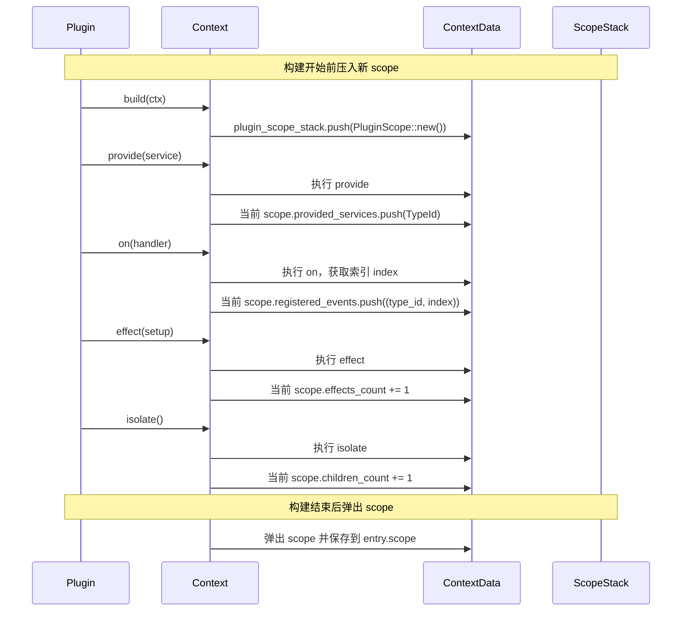

#### 3.6.3 卸载流程

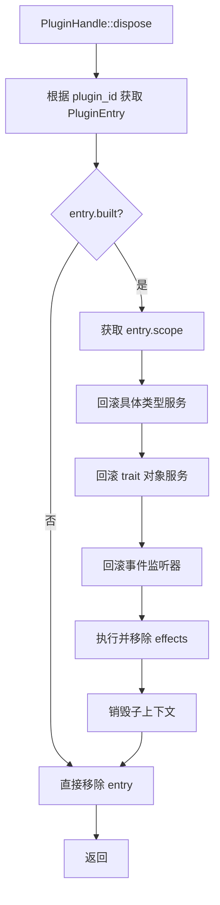

**回滚细节**：

*   **服务回滚**：对 `provided_services` 和 `provided_trait_services` 中每个 `TypeId`，检查 `service_owners` / `trait_service_owners` 是否仍指向本插件；是则移除服务与所有者条目，否则跳过（已被后续插件或根级覆盖）。不恢复被覆盖的旧值。
    
*   **事件回滚**：对 `registered_events` 中的每个 `(type_id, index)`，从对应事件列表中移除该索引。由于可能有多个监听器，需要从后往前移除，保持索引有效。
    
*   **effects 回滚**：`effects` 列表中属于该插件的部分连续存储，记录起始位置和数量，将其取出并逆序执行。
    
*   **子上下文销毁**：销毁该插件创建的子上下文（调用其 `dispose()`）。
    

### 3.7 上下文隔离（isolate）

上下文隔离允许创建子上下文，子上下文继承父上下文的服务，但自身的修改不影响父上下文。

#### 3.7.1 创建子上下文

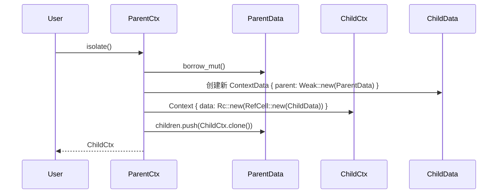

**特点**：

*   `parent` 为 `Weak`，避免循环引用。
    
*   子上下文被添加到父上下文的 `children` 列表中，用于级联销毁。
    

#### 3.7.2 服务继承与覆盖

*   服务查找从当前上下文开始，若不存在则沿 `parent` 链向上递归查找，实现了继承。
    
*   子上下文调用 `provide` 会覆盖父上下文中的同名服务，但只影响子上下文及其后代，父上下文保持不变。
    

#### 3.7.3 隔离效果

*   事件监听、effects、插件注册仅存在于当前上下文，不会泄漏到父级。
    
*   父子上下文生命周期相互独立，但父销毁时级联销毁子。
    

### 3.8 生命周期管理（start / dispose）

生命周期管理是框架的闭环，确保插件在正确的时间构建和清理。

#### 3.8.1 启动流程

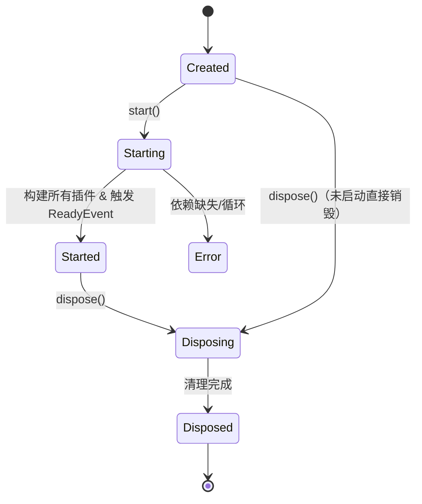

`start()` 的具体步骤：

1.  检查状态：若已启动或已销毁，返回错误。
    
2.  构建所有未构建的插件（采用延迟队列方式，尝试构建直到没有进展）。
    
3.  若存在无法构建的插件（依赖缺失或循环依赖），返回错误。
    
4.  触发 `ReadyEvent`。
    
5.  设置 `started = true`。
    

#### 3.8.2 销毁流程

`dispose()` 的具体步骤：

1.  检查状态：若已销毁，直接返回（幂等）。
    
2.  触发 `DisposeEvent`。
    
3.  逆序执行所有 `effects`。
    
4.  递归销毁所有子上下文（调用子上下文的 `dispose()`）。
    
5.  清空所有插件、服务、事件、effects 等数据结构。
    
6.  设置 `disposed = true`。
    

**注意**：销毁上下文时，插件本身不需要单独卸载（因为整个容器被销毁），但若有外部资源需释放，可依赖插件的 effects。通常直接清空即可，因为 effects 已执行。

### 3.9 中间件 / 拦截器钩子

框架在核心提供轻量拦截器机制，允许在插件构建和事件触发前后插入自定义逻辑，用于日志、权限检查、性能监控等。

#### 3.9.1 ContextInterceptor trait

```rust
pub trait ContextInterceptor {
    fn before_plugin_build(&self, plugin: &dyn Plugin) {}
    fn after_plugin_build(&self, plugin: &dyn Plugin) {}
    fn before_emit(&self, event: &dyn Any) {}
    fn after_emit(&self, event: &dyn Any) {}
}
```

*   每个方法默认空实现。
*   **对象安全（刻意偏离）**：设计早期伪代码曾写 `before_emit<E>` / `after_emit<E>`；为实现 `Rc<dyn ContextInterceptor>`，emit 钩子改为 `&dyn Any`。调用方用 `downcast_ref` / `is` 识别类型。
*   拦截器可观察插件与事件；框架在调用前快照列表并释放借用，故钩子内允许有限重入（`provide` / `on` / `emit` 等）而不因 `RefCell` panic。钩子不应 panic。
*   **`build` 失败约定**：仅调用 `before_plugin_build`；**不**调用 `after_plugin_build`。成功路径：全部 before → build → 全部 after（均为注册序 FIFO）。

#### 3.9.2 注册与调用

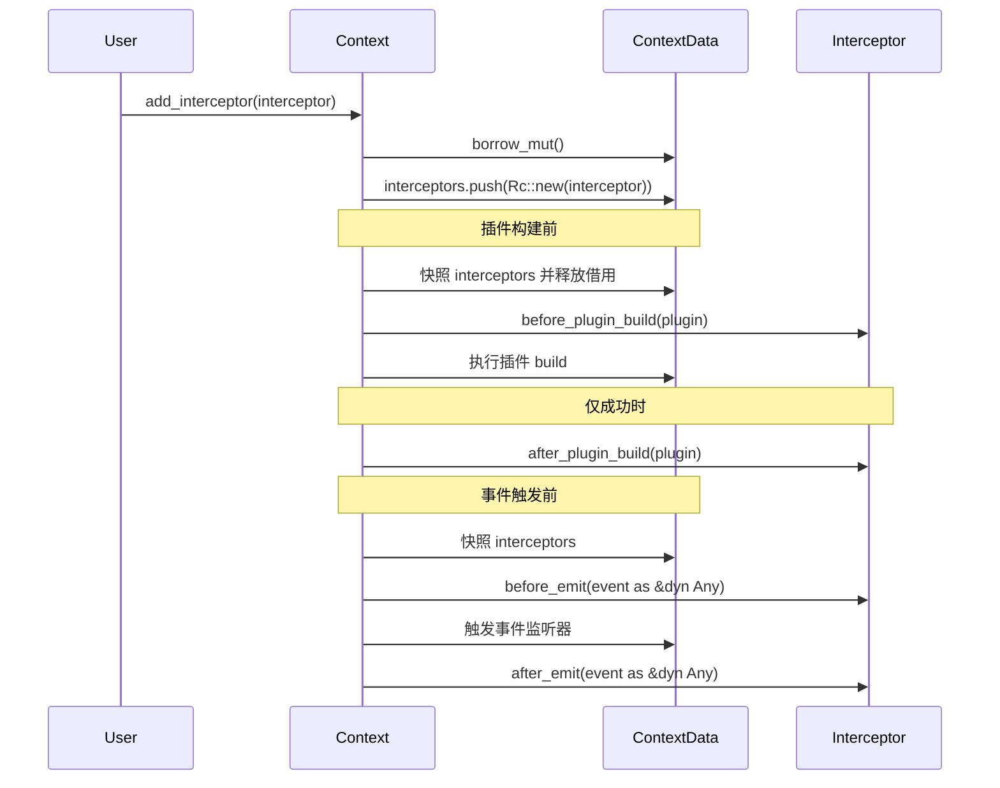

**设计考虑**：

*   拦截器按注册顺序调用（before/after 均为 FIFO，非洋葱逆序）。
*   拦截器注册在上下文上，子上下文不继承父上下文的拦截器（若需继承，可自行在子上下文中注册）。
*   拦截器方法不应 panic；本版本不 `catch_unwind`。
*   存储为 `Vec<Rc<dyn ContextInterceptor>>`，便于快照后重入。

---

以上是核心组件的详细设计。这些组件共同构成了 `plugctx` 框架的最小同步内核，为上层扩展模块提供稳定基础。后续章节将描述扩展模块的设计以及关键流程。