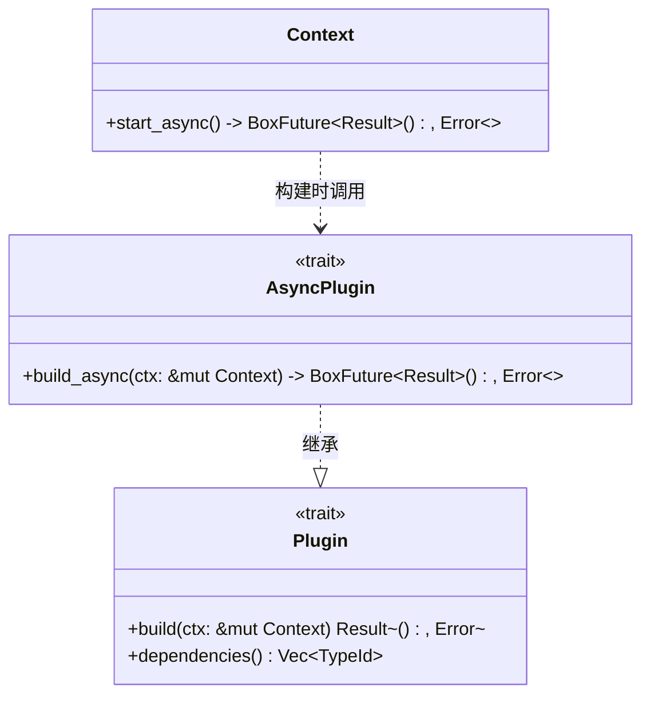
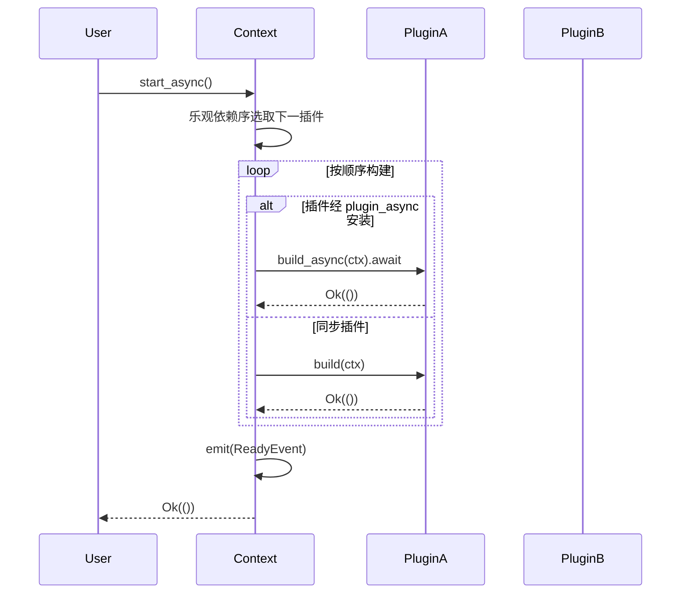
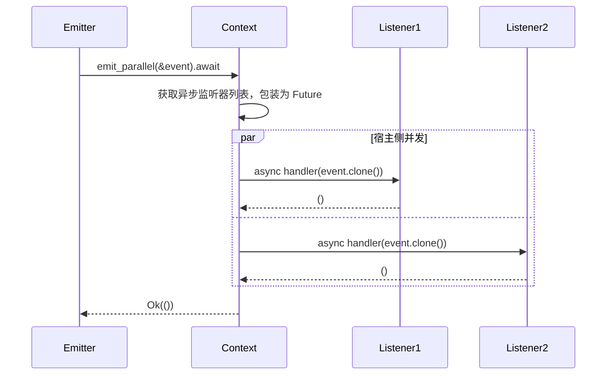
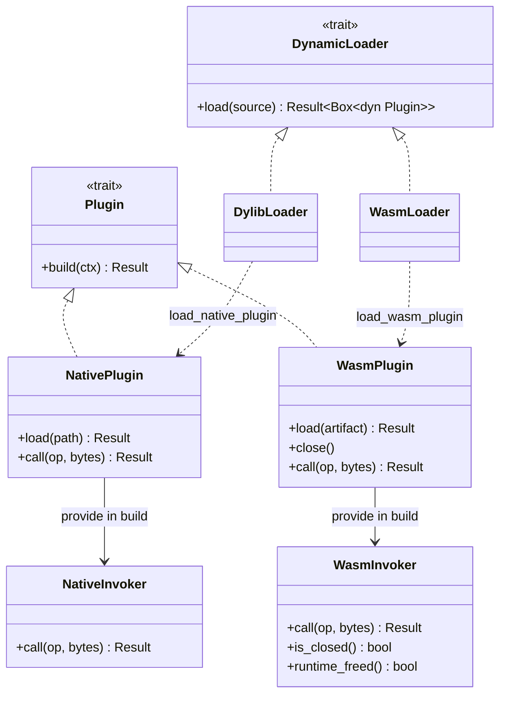
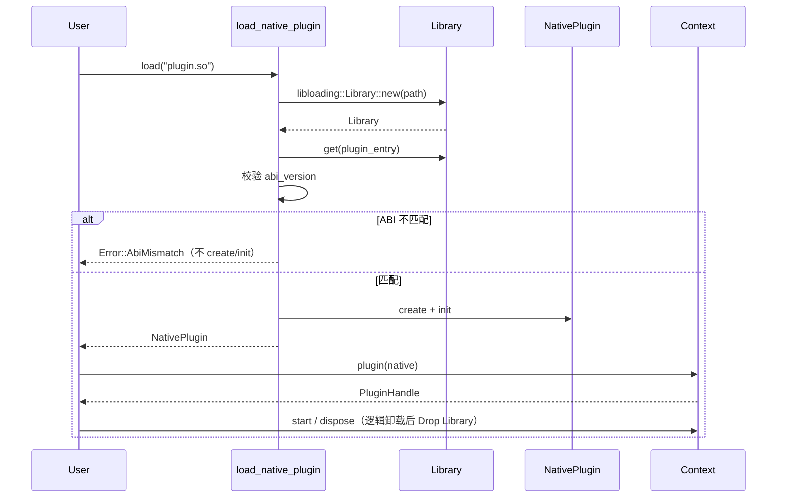
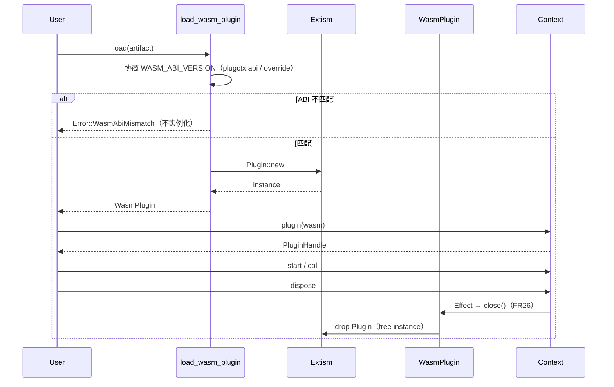
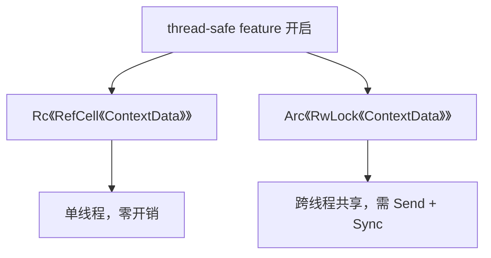
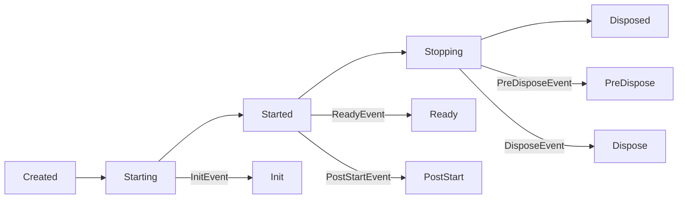

# 4. 扩展模块设计

## 4. 扩展模块设计

本章详细描述 `plugctx` 框架的扩展模块设计。扩展模块围绕核心最小内核构建，通过 Cargo features 或独立 crate 提供，开发者可按需引入，保持核心轻量。模块包括异步支持、并行事件、动态加载、过程宏、服务 trait 对象、多线程支持和生命周期阶段扩展。

### 4.1 异步支持（async feature）

#### 4.1.1 目标

允许插件在构建阶段执行异步初始化任务（如连接数据库、加载配置），并与框架生命周期无缝集成。

#### 4.1.2 设计思路

核心 `Plugin` trait 保持同步，引入扩展 trait `AsyncPlugin`，通过 `async-trait` 支持异步方法。启用 `async` feature 后，`Context` 提供异步启动方法 `start_async`，按顺序执行插件的异步构建。



#### 4.1.3 关键接口

```rust
#[async_trait]
pub trait AsyncPlugin: Plugin {
    async fn build_async(&self, ctx: &mut Context) -> Result<(), Error>;
}

```

*   `AsyncPlugin` 继承 `Plugin`。因 Rust 无法从 `dyn Plugin` 可靠探测异步实现，异步插件须通过 `Context::plugin_async` 安装，以便 `start_async` 调用 `build_async`；仅 `plugin` 安装的条目在 `start_async` 中仍走同步 `build`。
    
*   `Context::start_async` 按与同步相同的乐观依赖序构建：异步条目调用 `build_async`，同步条目调用 `build`。
    
*   依赖排序逻辑与同步版本一致，仍基于 `dependencies()`。
    

#### 4.1.4 与核心交互



#### 4.1.5 依赖与 feature

*   依赖：`async-trait`、`futures`（或标准库 `Future`）。**不**依赖 tokio / async-std 等具体运行时；由调用方提供执行环境。
    
*   feature 名称：`async`。
    
*   启用后，框架不依赖具体运行时，由调用方提供异步执行环境。
    
*   未启用 `async` 时，核心默认同步路径零异步依赖（NFR1 / NFR5）。
    

### 4.2 并行事件触发（parallel feature）

#### 4.2.1 目标

在需要并行处理多个监听器的场景下，提供 `emit_parallel` 方法，使用异步并发执行监听器，提升吞吐量。

#### 4.2.2 设计思路

核心 `emit` 保持同步顺序。`emit_parallel` 借助 `futures::future::join_all` 在**宿主侧**并发执行**异步**监听器。并行发生在宿主 Future 调度上，不要求插件内多线程（NFR10）。该功能依赖 `futures`，通过 `parallel` feature 启用（并联动 `async`）；框架本身不绑定 tokio/async-std。

**刻意偏离**：同步 `on` 仍注册 `FnMut(&E)`。异步监听须用 `on_async`（类比 `plugin_async`），与同步监听分轨——`emit` 只调用同步槽，`emit_parallel` 只调用异步槽。


#### 4.2.3 关键接口

```rust
impl Context {
    pub fn on_async<E, F, Fut>(&self, handler: F) -> EventListenerHandle
    where
        E: Clone + 'static,
        F: FnMut(E) -> Fut + 'static,
        Fut: Future<Output = ()> + 'static;

    pub async fn emit_parallel<E: Clone + 'static>(
        &self,
        event: &E,
    ) -> Result<(), Error>;
}
```

示意实现要点：

```rust
let futures = listeners.into_iter()
    .filter(|l| !l.cancelled)
    .map(|listener| listener(event.clone()))
    .collect::<Vec<_>>();
futures::future::join_all(futures).await;
```

*   事件类型需 `Clone + 'static`（fan-out 时按值克隆进各 Future；避免 `'static` Future 借用 `&E`）。
    
*   Future **不**强制 `Send`（与 `Rc` Context / `async_trait(?Send)` 一致）。
    
*   使用 `join_all` 并发执行，等待所有监听器完成。
    
*   若需要限制并发数量，可引入 `stream::iter().buffer_unordered(n)`（本版不做）。
    

#### 4.2.4 与核心交互



#### 4.2.5 依赖与 feature

*   依赖：复用 `async` feature 引入的 `futures`（optional）。
    
*   feature 名称：`parallel = ["async"]`。
    
*   未启用 `parallel` 时核心仅有同步 `emit`（NFR5）。
    

### 4.3 动态加载插件（dynamic-native / dynamic-wasm）

#### 4.3.1 目标

允许在运行时从外部文件加载插件。原生路径使用**稳定 C ABI + `libloading`**；可销毁/沙箱扩展走 WASM（`dynamic-wasm`）。  
**原生「卸载」= 先逻辑卸载（撤销 Context 注册与 Effect），再物理卸载（Drop `libloading::Library` → `dlclose` / `FreeLibrary`）**。热插拔 = load → use → dispose → load，不提供 `reload()`。

物理卸载限度（与 [`docs/guide.md`](../guide.md) 一致，FR4）：

1. `FreeLibrary` / `dlclose` 成功 ≠ 文件一定可覆盖（Windows 上其它模块引用、PIN 仍可能锁 `.dll`；须先 dispose 或换路径）。
2. macOS 上带非平凡 TLS 析构的 dylib 可能永不卸载；`dlclose` 成功 ≠ unmap。
3. sound 卸载要求无残留引用、出站函数指针、库内线程。

**WASM「卸载」= 实例级显式 close/free**，释放扩展侧运行时资源（FR26），**不是** native `dlclose`。Component 路径销毁 = Drop Store（FR49）。


#### 4.3.2 设计思路

核心通过适配器把外部插件接入同一 `Plugin` / `Context` 生命周期。`dynamic-native` 复用工作区 `plugin-api` 的 `PluginVTable`，**禁止**跨 DSO 传递不稳定 `dyn Trait`，**不以 `abi_stable` 为基线**。

`dynamic-wasm` 提供 `WasmPlugin` / `WasmInvoker` / `load_wasm_plugin`：实例在 dispose 时**必须**走显式 `close()`（Effect），测试用 `explicit_close_count` / `runtime_freed` 防止「仅 Drop 宿主句柄却泄漏运行时」回归。

**ABI 版本协商（NFR6）**：native 使用 `PLUGIN_ABI_VERSION`（vtable `abi_version`）；wasm 使用 `WASM_ABI_VERSION`（制品 custom section `plugctx.abi` / `abi_override`，缺省视为与宿主相同）。不匹配分别返回 `Error::AbiMismatch` / `Error::WasmAbiMismatch`，拒绝半初始化。宿主与 native 插件须同工具链锁定；**不以 `abi_stable` 为基线**。

**生命周期对齐（FR23）**：动态适配器与进程内插件共用 `plugin` / `start`（延迟或立即 build）/ `PluginHandle::dispose`（scope 卸载）；可混合安装，依赖排序与事件语义一致。

**统一加载入口（FR34）**：`DynamicLoader` trait（`DynamicSource::Path | Bytes` → `Box<dyn Plugin>`）与 Interceptor / AsyncPlugin 同级。`DylibLoader` / `WasmLoader` 分别实现；底层仍委托 `load_native_plugin` / `load_wasm_plugin`。失败返回可诊断错误，不半初始化 Context。

**引擎边界**：`dynamic-wasm` 接入 **Extism** 真实运行时（仅可选 feature 依赖，**不**进入默认依赖图）。制品为合法 WASM；验收内置 `testdata/echo.wasm`（Extism PDK `wasm_echo`）。dispose / `close` 显式 `drop` Extism 实例（FR26）。

**并行**：NFR10 要求并行 fan-out 在宿主侧、不假定 WASM guest 内多线程。宿主侧**逻辑** WASM 实例池已交付为可选 feature `dynamic-wasm` 下的 `WasmInstancePool`（有界 `max_instances`、超时 checkout、Drop 归还 + reset/等价重建、显式 destroy；验收 `acceptance_story_7_1` / `7_2`）。该逻辑池 ≠ Wasmtime `PoolingAllocationConfig`（运行时资源槽）；本 crate 不暴露后者。单实例路径仍可用 `load_wasm_plugin` + 显式 `close`/`free`。



*   `DynamicLoader::load(DynamicSource)` → `Box<dyn Plugin>`；`DylibLoader` / `WasmLoader` 分别包装 native / wasm 路径。
*   `load_native_plugin(path)` 打开库、校验 `PLUGIN_ABI_VERSION`、`create`/`init`，返回实现 `Plugin` 的适配器。
*   `load_wasm_plugin(artifact, config)` 校验 `WASM_ABI_VERSION`（custom section `plugctx.abi` / `abi_override`），再经 **Extism** 实例化；`build` 提供 `WasmInvoker` 并登记 Effect → `close()`。
*   native：dispose / Effect 在 `vtable.destroy` 之后 Drop `Library`（物理卸载）。
*   wasm：dispose / Effect **显式 close**；Drop 仅作兜底且不计入显式 close 探针。
*   混合：进程内 + native + wasm 可同 Context；依赖排序与 `on`/`emit` 语义与纯进程内一致。

#### 4.3.3 关键流程





#### 4.3.4 安全考虑

*   跨越 FFI 时注意 panic 边界；native ABI 变更须递增 `PLUGIN_ABI_VERSION`，wasm 递增 `WASM_ABI_VERSION`。
*   同工具链/同 `plugin-api` 版本构建宿主与 native 插件；加载前版本协商，失败可诊断。
*   第三方不可信代码优先走 WASM 实例关闭（FR26）。
*   native 热插拔正确性建立在 dispose 后 Drop `Library`（`dlclose`）之上；失效 `NativeInvoker` 不得再成功 `call`。
*   `FreeLibrary`/`dlclose` 成功仍可能无法覆盖文件；macOS TLS 可能永不卸载；sound 卸载须无残留引用、出站函数指针、库内线程（FR4）。不把 `hot-lib-reloader` 写成生产公开 API。


#### 4.3.5 依赖与 feature

*   `dynamic-native`：`libloading`、`plugin-api`（C ABI 契约）。
*   `dynamic-wasm`：可选依赖 `extism`（真实引擎）；**不得**进入默认 features / 默认依赖图。


### 4.4 过程宏辅助（plugctx-derive）

#### 4.4.1 目标

通过独立过程宏 crate 自动实现 `Plugin` trait 的依赖声明样板，减少手写 `dependencies()` ；**不**强迫核心 `plugctx` 依赖 proc-macro（FR27 / NFR5）。

#### 4.4.2 设计思路

提供 `#[derive(Plugin)]`（crate：`plugctx-derive`）。通过容器属性 `#[plugin(depends(TypeA, TypeB))]` 声明依赖类型，宏生成：

*   `dependencies()` → `vec![TypeId::of::<TypeA>(), ...]`（无 `depends` 时为空列表）；
*   `build()` → 委托用户固有方法 `on_build(&self, ctx: &mut Context) -> Result<(), Error>`。

与当前核心 API（`Plugin::build` 取 `&self`）对齐；服务获取仍在 `on_build` 内调用公开 `ctx.get` / `provide`，不引入过时的 `Service<T>` 字段赋值模型。


示例：

```rust
use plugctx_derive::Plugin;

#[derive(Plugin)]
#[plugin(depends(Logger, Database))]
struct MyPlugin;

impl MyPlugin {
    fn on_build(&self, ctx: &mut plugctx::Context) -> Result<(), plugctx::Error> {
        let _logger = ctx.get::<Logger>();
        let _db = ctx.get::<Database>();
        Ok(())
    }
}
```

宏生成的代码大致为：

```rust
impl plugctx::Plugin for MyPlugin {
    fn dependencies(&self) -> Vec<TypeId> {
        vec![TypeId::of::<Logger>(), TypeId::of::<Database>()]
    }
    fn build(&self, ctx: &mut Context) -> Result<(), Error> {
        Self::on_build(self, ctx)
    }
}
```

#### 4.4.3 与核心关系

*   宏生成代码调用核心公开 API，不修改核心。
    
*   独立 crate `plugctx-derive`，通过 `proc-macro` 实现；核心 `plugctx` 的 `Cargo.toml` **不得**依赖本 crate。
    
*   仅依赖核心、不引入 derive 时，手写 `impl Plugin` 仍完全可用。
    

#### 4.4.4 依赖

*   宏 crate 依赖：`syn`、`quote`、`proc-macro2`。
*   使用方同时依赖：`plugctx` + `plugctx-derive`。
*   误用（如对 enum derive、缺少 `on_build`）由 trybuild 钉死常见失败路径。

### 4.5 服务 trait 对象支持

#### 4.5.1 目标

允许以 trait 对象形式注册多个实现不同 trait 的服务，或同一 trait 的多个不同实现（通过不同 trait 类型区分），增强服务灵活性。

#### 4.5.2 设计思路

核心已在 `ContextData` 中增加独立 `trait_services` 表，并提供 `provide_trait` 和 `get_trait` 方法（与具体类型 `services` 隔离；默认同步、零 async）。

```rust
impl Context {
    pub fn provide_trait<T: ?Sized + 'static>(&self, service: Box<T>) -> Option<Box<T>>;
    pub fn get_trait<T: ?Sized + 'static>(&self) -> Option<Ref<T>>;
}

```

*   `T` 为 trait 对象类型，如 `dyn Database`，其 `TypeId` 唯一标识该 trait。
    
*   存储时先擦除为 `Box<dyn Any>`，获取时 `downcast_ref::<Box<T>>()` 再解引用。
    

#### 4.5.3 使用示例

```rust
trait Database: Any { fn query(&self); }

struct Postgres;
impl Database for Postgres { ... }

ctx.provide_trait::<dyn Database>(Box::new(Postgres));

let db = ctx.get_trait::<dyn Database>().unwrap();
db.query();

```

#### 4.5.4 与核心关系

*   此功能作为核心 API 的一部分直接提供，因为实现成本低且扩展性好。
    
*   不影响现有具体类型服务。
    

### 4.6 多线程支持（thread-safe feature）

#### 4.6.1 目标

使 `Context` 可以跨线程共享，支持多线程环境下的插件运行。

#### 4.6.2 设计思路

将内部存储容器从 `Rc<RefCell<ContextData>>` 替换为 `Arc<RwLock<ContextData>>`，通过 feature 切换。同时要求服务类型、插件类型、事件监听器等实现 `Send + Sync`。



#### 4.6.3 实现方式

在 `plugctx` 中通过 `shared::Shared` 抽象存储类型（默认 `Rc<RefCell<_>>`，启用 `thread-safe` 后为 `Arc<parking_lot::RwLock<_>>`）：

```rust
#[cfg(not(feature = "thread-safe"))]
type SharedData = Rc<RefCell<ContextData>>;
#[cfg(feature = "thread-safe")]
type SharedData = Arc<parking_lot::RwLock<ContextData>>;

pub struct Context {
    data: SharedData,
}
```

*   选用 `parking_lot`：提供稳定的 `MappedRwLock*Guard`，以便 `get` /`get_mut` /`get_trait` 继续返回可 `Deref` 的守卫（标准库 `RwLock` 无稳定 `map`）。
*   插件 `Plugin`、拦截器 `ContextInterceptor`、服务与监听器闭包在 `thread-safe` 下要求 `Send + Sync`。
*   事件监听器存储为 `Arc<Mutex<dyn FnMut + Send>>`；`emit` 先快照再回调。跨线程并发 `emit` 对同一监听器**阻塞串行**；同线程嵌套再次进入同一监听器可能死锁，应避免。
*   持有 `get` 返回的 `ServiceRef`/`ServiceMut` 期间，勿再调用会取写锁的 API（`provide`/`emit`/`start` 等），否则可能死锁。

#### 4.6.4 挑战

*   默认路径仍用 `Rc<RefCell>`（NFR5）；仅启用 feature 时切换。
*   服务 `Send + Sync` 与监听器 `Send` 约束会收紧 API；未启用 feature 时保持原简洁性。
*   重入：默认同监听器 `try_borrow_mut` 跳过；`thread-safe` 下改为阻塞锁串行。

#### 4.6.5 依赖与 feature

*   可选依赖：`parking_lot`（仅 `thread-safe`）。
*   feature 名称：`thread-safe`，默认为关闭。
*   验收：`tests/acceptance_story_4_1.rs`（`required-features = ["thread-safe"]`）。

### 4.7 生命周期阶段扩展

> **交付状态（FR32）**：通过 Cargo feature `stages` 启用；零额外依赖。未启用时核心仍保证 `ReadyEvent` / `DisposeEvent`。

#### 4.7.1 目标

提供更丰富的生命周期事件（如 `Init`、`PostStart`、`PreDispose`），让插件可以在不同阶段执行逻辑。

#### 4.7.2 设计思路

核心已内置 `ReadyEvent` 和 `DisposeEvent`。扩展通过定义更多内置事件类型实现，无需修改核心架构。插件只需监听对应事件即可。



#### 4.7.3 关键事件类型

```rust
pub struct InitEvent;
pub struct ReadyEvent;
pub struct PostStartEvent;
pub struct PreDisposeEvent;
pub struct DisposeEvent;

```

框架在生命周期关键节点触发这些事件，用户通过 `ctx.on(|_: &InitEvent| ...)` 监听（须启用 feature `stages`）。

**触发顺序（已实现）**：

*   `start` / `start_async`：`InitEvent` → 构建插件 → `ReadyEvent` → `PostStartEvent`
*   `dispose`：`PreDisposeEvent` → `DisposeEvent` → effects 逆序 cleanup → 级联子上下文
*   构建失败：可能已发 `InitEvent`，不发 Ready/PostStart，不进入 Started

#### 4.7.4 与核心关系

*   在 `start()` 和 `dispose()` 流程中于约定节点 `emit`；复用现有事件总线。
    
*   若需要严格控制执行顺序（例如某些逻辑必须在其他逻辑之前），可使用拦截器或引入阶段调度器，但初期用事件即可满足。
    
*   feature 名：`stages`；默认为关闭（NFR5）。

---

以上是扩展模块的设计。通过 feature 和独立 crate，开发者可以按需引入功能，核心保持轻量且可扩展。后续章节将描述关键流程，包括异步构建、并行事件和动态加载的具体时序。