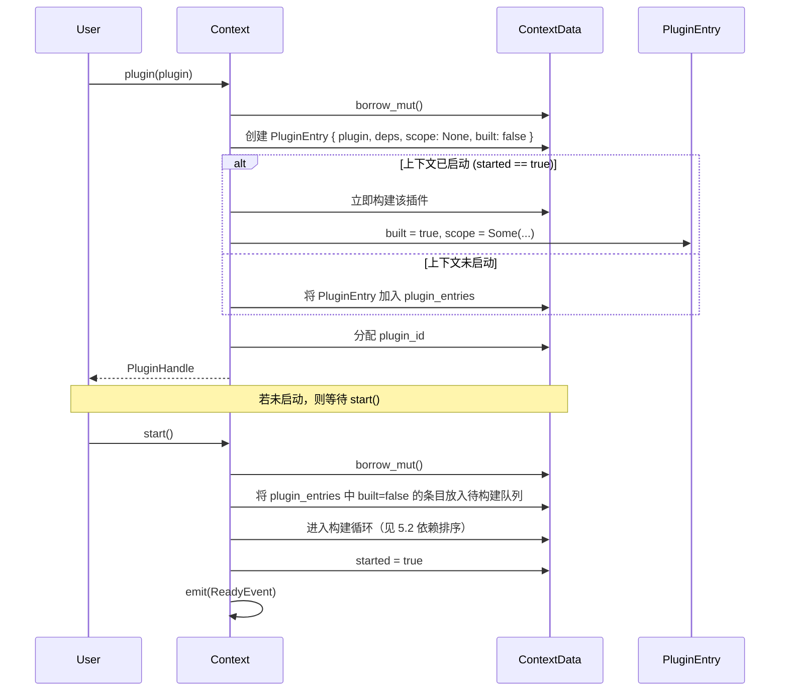
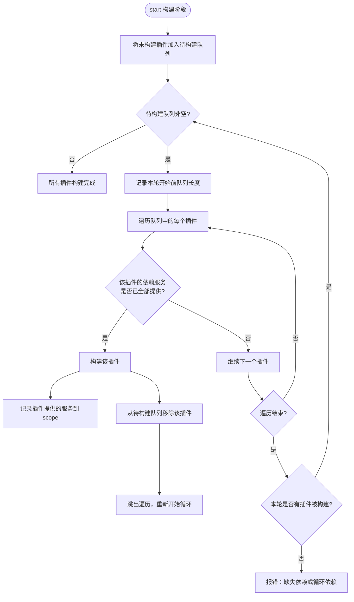
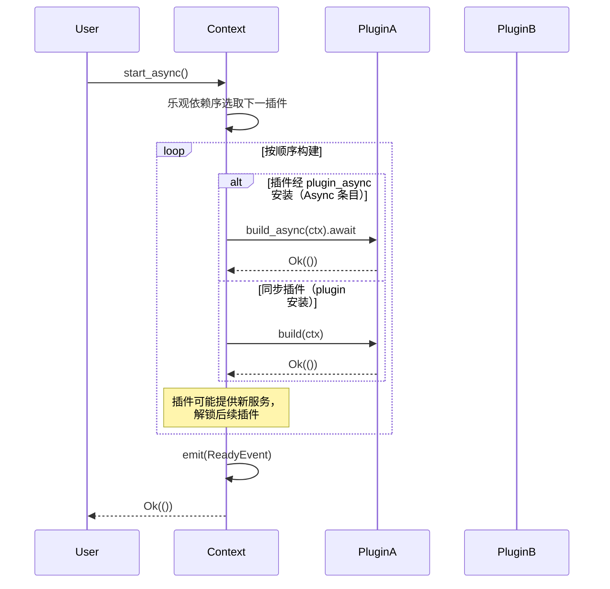
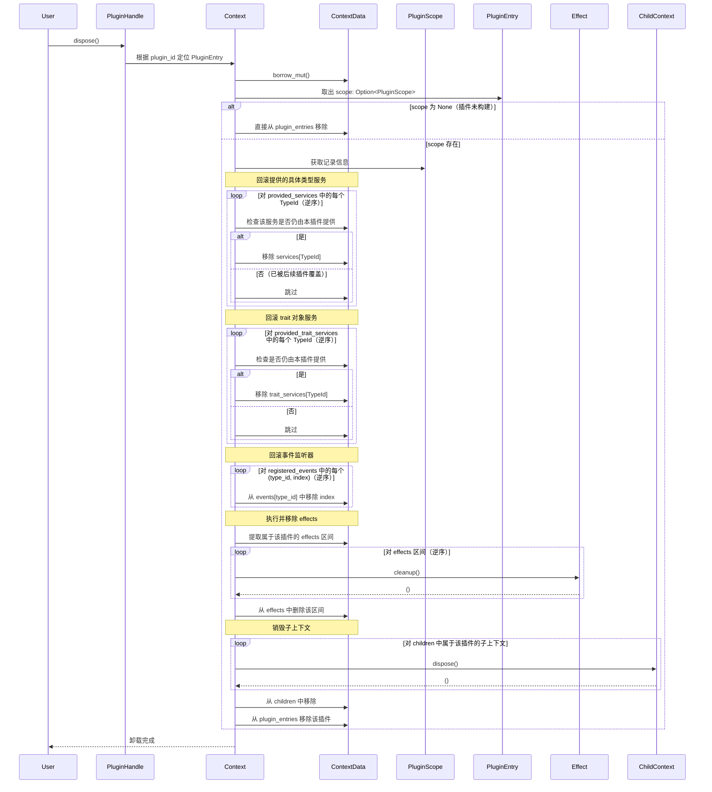
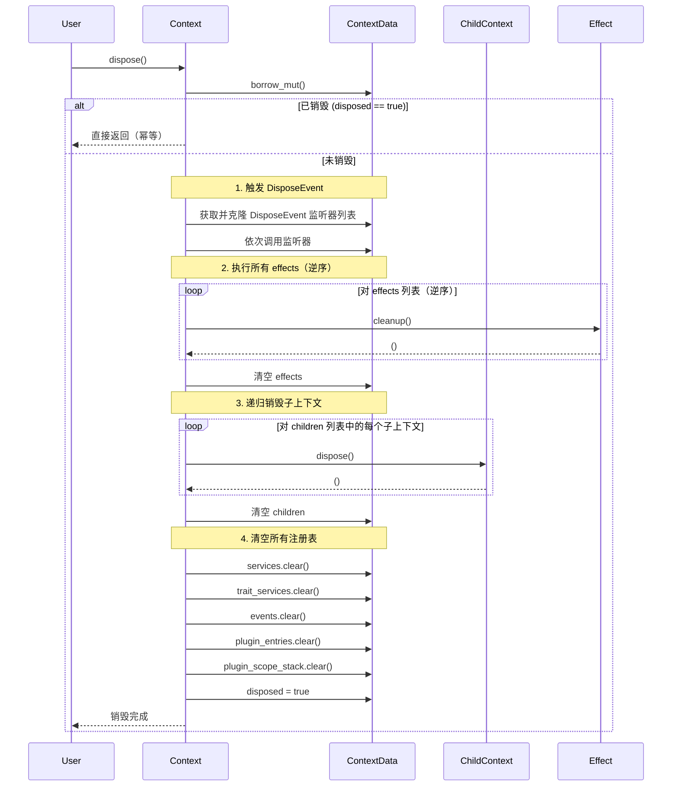
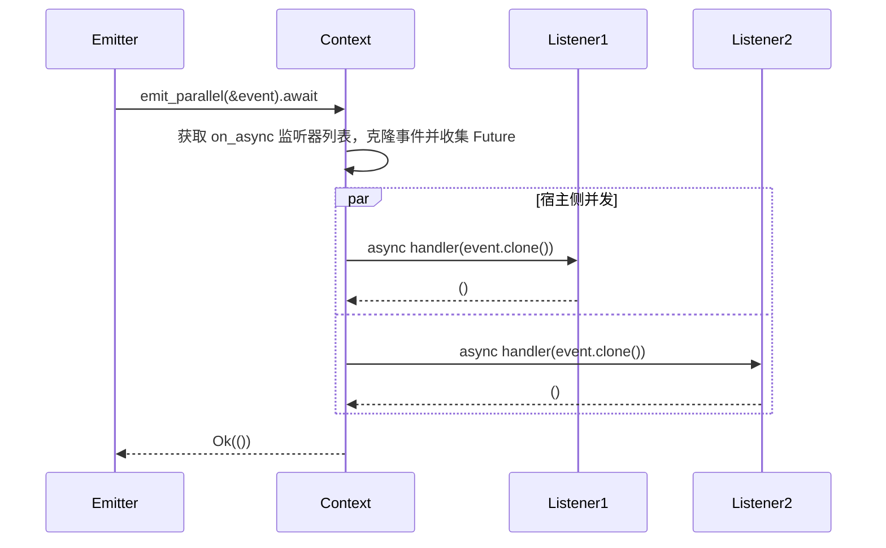
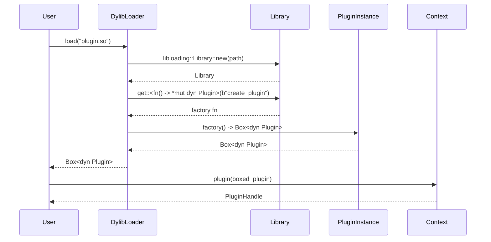

# 5. 关键流程

## 5. 关键流程

本章节详细描述 `plugctx` 框架在运行时的重要流程，包括插件的安装与延迟构建、依赖排序与注入（含异步构建）、插件卸载回滚、上下文销毁级联、并行事件触发以及动态加载插件。每个流程均通过 Mermaid 图展示完整交互步骤。

### 5.1 插件安装与延迟构建

插件可以在上下文启动前或启动后安装。安装时若上下文尚未启动，插件被暂存，待 `start()` 时统一构建；若已启动，则立即构建。

**关键点**：

*   安装时返回 `PluginHandle`，用户可提前保存，之后用于卸载。
    
*   延迟构建允许插件在启动前安装，启动时统一初始化，确保所有服务就绪。
    
*   如果上下文已启动，新插件会立即构建，并要求其依赖的服务已存在。
    

### 5.2 依赖排序与注入（含异步构建）

框架采用 **乐观构建 + 循环尝试** 的策略处理插件依赖。插件通过 `dependencies()` 声明其所需的服务类型，框架在构建前检查这些服务是否已存在。若满足则构建；构建过程中插件可能提供新服务，从而解锁其他插件。启用 `async` feature 后，支持异步构建。

#### 5.2.1 同步构建流程

#### 5.2.2 异步构建流程（`async` feature 启用）

异步构建使用 `start_async()`，构建循环与同步类似，但插件构建是异步的，框架必须等待每个插件完成后再继续。

**依赖检查**：每次构建前检查所需服务是否存在，不区分服务由哪个插件提供。如果插件构建后提供了新服务，立即影响后续判断。

**循环检测**：若一轮遍历没有任何插件被构建，说明存在循环依赖或缺失依赖，返回错误。

**确定性**：构建顺序在满足依赖的前提下按安装顺序优先，保持可预测。

### 5.3 插件卸载回滚流程

插件卸载需要精确回滚该插件在构建期间产生的所有副作用，包括提供的服务、注册的事件监听器、注册的 effects 和创建的子上下文。框架通过 `PluginScope` 记录这些信息，卸载时按逆序回滚，确保不影响其他插件。

**回滚细节**：

*   **服务回滚的条件**：必须确保移除的服务确实是由该插件提供的。实现维护 `service_owners` / `trait_service_owners`（`TypeId` → `PluginId`）：插件 `build` 内 `provide`/`provide_trait` 更新所有者；根级调用清除所有者。卸载时仅当所有者仍为本插件才移除；已被后续插件或根级覆盖则跳过。不恢复被覆盖的旧值。（FR33 / §5.3）

*   **事件监听器回滚**：按索引逆序移除，避免索引偏移影响。因为监听器列表可能因其他插件卸载而变化，但同一事件类型下的监听器顺序稳定，逆序移除可以保持索引有效。

*   **effects 回滚**：插件注册的 effects 在全局 `effects` 列表中是连续的（因为构建期间没有其他插件插入）。记录起始索引和数量，卸载时取出该区间并逆序执行。

*   **子上下文回滚**：插件通过 `isolate` 创建的子上下文被记录在 `PluginScope.children_start/count` 中，卸载时逐个销毁。

*   **重入**：卸载开始时先从 `plugin_entries` 移除条目，再执行 cleanup，避免 cleanup 内再次 `dispose` 同一句柄导致重复回滚。

### 5.4 上下文销毁级联流程

上下文销毁会触发完整的清理流程，包括触发 `DisposeEvent`、执行所有 effects、递归销毁子上下文、清空数据结构。该流程保证资源释放的确定性和完整性。

**关键点**：

*   **幂等性**：重复调用 `dispose()` 安全，第二次直接返回。
    
*   **顺序保证**：
    
    1.  先触发 `DisposeEvent`，允许插件在资源释放前做最后的清理工作。
        
    2.  执行 effects，这是大多数资源释放的最终出口。
        
    3.  递归销毁子上下文，确保子上下文的 effects 也按同样顺序执行。
        
    4.  清空注册表，释放内存。
        
*   **监听器克隆**：触发 `DisposeEvent` 时监听器内部可能修改事件系统，因此需要克隆监听器列表再调用，避免借用冲突。
    
*   **插件无需单独卸载**：整个上下文销毁时，插件的 effects 已包含在全局 effects 中，所以单独卸载插件反而多余。
    

### 5.5 并行事件触发流程（`parallel` feature 启用）

并行事件触发允许**异步**监听器在宿主侧并发执行，提高吞吐量。流程使用 `futures::future::join_all` 等待全部完成；框架不绑定具体异步运行时。同步 `emit` 仍按注册序串行，且只调用 `on` 注册的同步监听器。

**步骤说明**：

1.  先通过 `on_async` 注册返回 `Future` 的监听器；事件类型需 `Clone + 'static`。
    
2.  `emit_parallel` 快照异步监听器列表，对每个未取消监听器克隆事件并取得 Future。
    
3.  使用 `join_all` 在宿主侧并发执行，等待全部完成（NFR10：并行在宿主侧，不要求插件内多线程）。
    
4.  无异步监听器时返回 `Ok(())`（仍可走拦截器 before/after）。
    
5.  同步 `on`/`emit` 路径不受影响（FR8 / NFR5）。
    

**注意**：并行触发的异步监听器完成顺序无法保证。若需要限制并发数，可使用 `buffer_unordered(n)` 或自定义并发控制（本版不做）。

### 5.6 动态加载插件流程

动态加载允许从外部文件（动态库或 WASM）加载插件，并作为 `Box<dyn Plugin>` 安装到上下文。以下以动态库加载为例展示流程。

**步骤说明**：

1.  用户使用 `DylibLoader::load` 加载指定路径的动态库。
    
2.  加载器使用 `libloading` 打开库文件。
    
3.  从库中获取导出函数 `create_plugin`，该函数返回一个指向实现 `Plugin` trait 的对象的指针。
    
4.  调用工厂函数，获取 `Box<dyn Plugin>`。
    
5.  返回给用户，用户将其作为普通插件安装到 `Context` 中。
    
6.  安装后的插件与静态插件行为一致，支持卸载、依赖注入等。
    

**WASM 插件加载**：流程类似，但使用 `wasmtime` 实例化 WASM 模块，通过定义的导入/导出函数与宿主通信。插件逻辑可能需要通过代理与 `Context` 交互，具体实现更复杂。

---

以上关键流程构成了框架的完整运行时闭环，确保了插件能够安全、可靠地安装、运行和卸载。后续章节将介绍 API 设计概览。