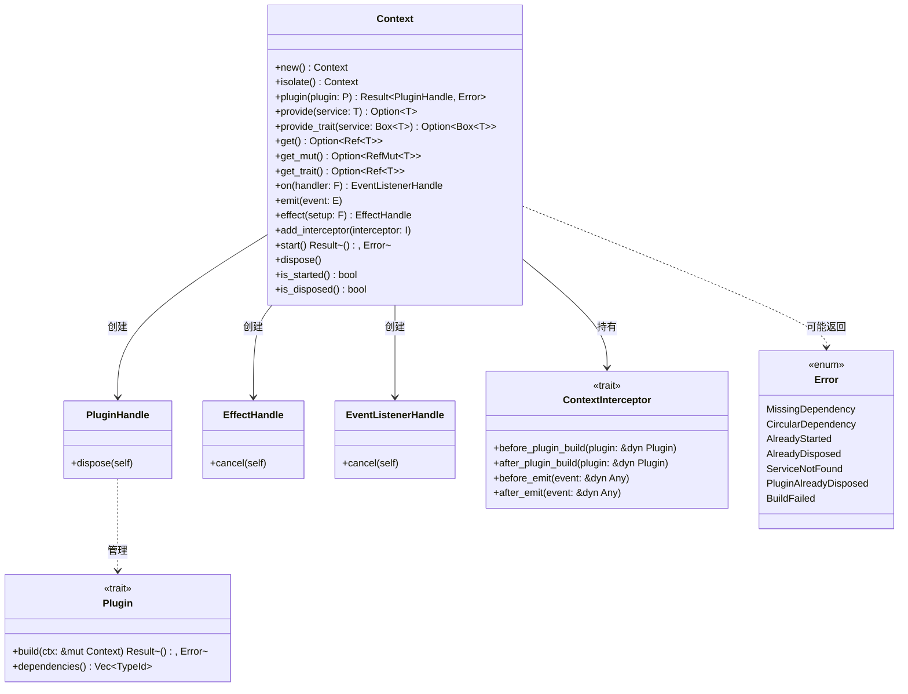
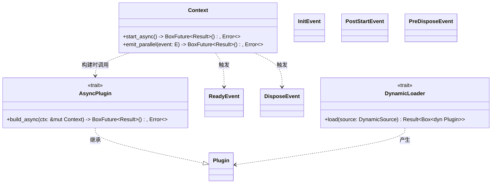
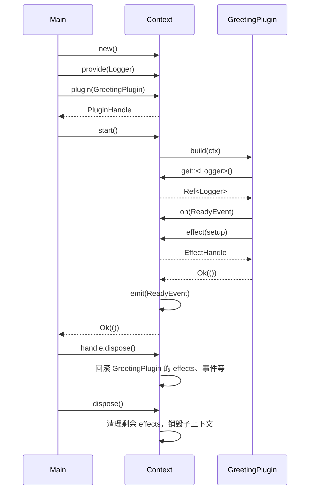

# 6. API 设计概览

## 6. API 设计概览

本章汇总 `plugctx` 框架的公共 API，包括核心最小内核与可选扩展模块。核心 API 保持稳定，扩展 API 按 feature 启用。所有 API 均遵循 Rust 惯例，返回 `Result` 处理可恢复错误，避免 panic 作为控制流。

### 6.1 核心 API 总览

核心 API 包含框架运行所需的基础类型和 trait，不依赖任何异步运行时或外部加载器。



### 6.2 核心 API 详细说明

#### 6.2.1 Plugin trait

```rust
pub trait Plugin {
    fn build(&self, ctx: &mut Context) -> Result<(), Error>;

    fn dependencies(&self) -> Vec<TypeId> { vec![] }

}

```

*   **build**：插件构建入口，负责注册服务、监听事件、添加副作用等。构建失败时，上下文启动流程中止。
    
*   **dependencies**：声明该插件依赖的服务类型，框架保证在 `build` 前这些服务已存在。默认无依赖。
    

#### 6.2.2 Context 方法

下表列出 `Context` 的主要方法。

| 方法 | 签名 | 描述 |
| --- | --- | --- |
| **创建根上下文** | `pub fn new() -> Self` | 创建无父级的新上下文。 |
| **创建子上下文** | `pub fn isolate(&self) -> Self` | 创建子上下文，继承父服务，修改互不影响。父销毁时子自动销毁。 |
| **安装插件** | `pub fn plugin<P: Plugin + 'static>(&self, plugin: P) -> Result<PluginHandle, Error>` | 安装插件。若上下文已启动则立即构建；否则延迟到 `start()`。返回句柄。 |
| **提供具体类型服务** | `pub fn provide<T: 'static>(&self, service: T) -> Option<T>` | 提供类型 `T` 的服务，返回被替换的旧服务（若有）。 |
| **提供 trait 对象服务** | `pub fn provide_trait<T: ?Sized + 'static>(&self, service: Box<T>) -> Option<Box<T>>` | 提供 trait 对象服务，键为 trait 的 `TypeId`；写入独立 `trait_services` 表；插件 build 时记入 `PluginScope`。 |
| **获取具体类型服务** | `pub fn get<T: 'static>(&self) -> Option<Ref<'_, T>>` | 获取不可变引用，支持父上下文查询。 |
| **获取可变服务** | `pub fn get_mut<T: 'static>(&self) -> Option<RefMut<'_, T>>` | 获取可变引用，支持父上下文查询。 |
| **获取 trait 对象服务** | `pub fn get_trait<T: ?Sized + 'static>(&self) -> Option<Ref<'_, T>>` | 获取 trait 对象引用，支持父上下文查询；与具体类型 `get` 分表。 |
| **注册事件监听器** | `pub fn on<E: 'static>(&self, handler: impl FnMut(&E) + 'static) -> EventListenerHandle` | 为事件类型 `E` 注册监听器，返回取消句柄。 |
| **触发事件** | `pub fn emit<E: 'static>(&self, event: &E)` | 同步触发所有监听器，按注册顺序调用。 |
| **注册副作用** | `pub fn effect<F, G>(&self, setup: F) -> EffectHandle`<br>`where F: FnOnce() -> G + 'static, G: FnOnce() + 'static` | 立即执行 `setup`，存储返回的清理闭包。返回句柄可提前取消。 |
| **添加拦截器** | `pub fn add_interceptor<I: ContextInterceptor + 'static>(&self, interceptor: I)` | 注册拦截器，在插件构建和事件触发前后调用。 |
| **启动** | `pub fn start(&self) -> Result<(), Error>` | 构建所有延迟插件，触发 `ReadyEvent`。依赖不满足时返回错误。 |
| **销毁** | `pub fn dispose(&self)` | 触发 `DisposeEvent`，逆序执行 effects，递归销毁子上下文，清空数据。幂等。 |
| **状态查询** | `pub fn is_started(&self) -> bool` | 是否已启动。 |
|  | `pub fn is_disposed(&self) -> bool` | 是否已销毁。 |

**借用说明**：`get`、`get_mut`、`get_trait` 返回 `Ref`/`RefMut`，基于 `RefCell` 的借用。开发者应避免长期持有这些引用跨越可能造成借用冲突的操作（如 `emit`、`plugin` 等）。

#### 6.2.3 句柄类型

*   **PluginHandle**：`dispose(&self) -> Result<(), Error>` 按构建期 `PluginScope` 精确卸载；首次 `Ok(())`，再次 `Err(PluginAlreadyDisposed)`。不消耗句柄，但条目移除后稳定键失效。服务回滚遵循 §5.3：仅当当前值仍由该插件提供（`service_owners` / `trait_service_owners`）时才移除；已被后续插件或根级覆盖则跳过。
    
*   **EffectHandle**：`cancel(self)` 取消副作用清理（从 effects 列表中移除而不执行清理闭包）。
    
*   **EventListenerHandle**：`cancel(self)` 移除事件监听器。
    

#### 6.2.4 ContextInterceptor trait

```rust
pub trait ContextInterceptor {
    fn before_plugin_build(&self, plugin: &dyn Plugin) {}
    fn after_plugin_build(&self, plugin: &dyn Plugin) {}
    fn before_emit(&self, event: &dyn Any) {}
    fn after_emit(&self, event: &dyn Any) {}
}
```

默认方法为空，可按需实现。拦截器按注册顺序同步调用（before/after 均为 FIFO）。

**约定**：

*   emit 钩子使用 `&dyn Any` 以保持对象安全（相对早期泛型伪代码的刻意偏离）。
*   插件 `build` 失败时不调用 `after_plugin_build`。
*   子上下文不继承父级拦截器。
*   钩子内允许有限重入 Context API。

#### 6.2.5 Error 类型

**已冻结交付（FR35）**：实现见 `plugctx::Error`（`thiserror`）。相对下方历史伪代码的刻意偏差：核心变体多为**单元变体**（无 `TypeId` / `Box<dyn Error>` 载荷），以保持 `Clone + PartialEq + Eq`；另保留 native/wasm 等扩展变体。完整对照表：[`docs/api-freeze.md`](../api-freeze.md)。

```rust
#[derive(Debug, thiserror::Error)]
pub enum Error {
    #[error("缺失依赖: 插件 {plugin:?} 需要服务 {service:?}")]
    MissingDependency { plugin: TypeId, service: TypeId },

    #[error("存在循环依赖，无法构建以下插件")]
    CircularDependency { plugins: Vec<TypeId> },

    #[error("上下文已经启动")]
    AlreadyStarted,

    #[error("上下文已经销毁")]
    AlreadyDisposed,

    #[error("服务未找到: {type_id:?}")]
    ServiceNotFound { type_id: TypeId },

    #[error("插件已卸载")]
    PluginAlreadyDisposed,

    #[error("插件构建失败: {0}")]
    BuildFailed(#[from] Box<dyn std::error::Error + Send + Sync>),
}

```

### 6.3 扩展 API 总览

扩展 API 通过 feature 启用，包括异步插件、并行事件、动态加载和生命周期事件类型。



### 6.4 扩展 API 详细说明

#### 6.4.1 异步支持（`async` feature）

**AsyncPlugin trait**：

```rust
#[async_trait]
pub trait AsyncPlugin: Plugin {
    async fn build_async(&self, ctx: &mut Context) -> Result<(), Error>;
}

```

**Context 异步启动**：

```rust
impl Context {
    pub async fn start_async(&self) -> Result<(), Error>;
}

```

当插件经 `plugin_async` 安装时，`start_async` 将调用 `build_async`；经 `plugin` 安装的同步插件回退到 `build`。依赖排序逻辑不变。框架不绑定单一异步运行时。

**安装 API**：

```rust
impl Context {
    pub fn plugin_async<P: AsyncPlugin + 'static>(&self, plugin: P) -> Result<PluginHandle, Error>;
}
```

> **刻意偏离**：设计示意曾写 `ctx.plugin(MyAsyncPlugin)`。Rust 无法从 `Box<dyn Plugin>` 探测 `AsyncPlugin`，故异步插件须用 `plugin_async`。

#### 6.4.2 并行事件（`parallel` feature，依赖 `async`）

```rust
impl Context {
    pub fn on_async<E, F, Fut>(&self, handler: F) -> EventListenerHandle
    where
        E: Clone + 'static,
        F: FnMut(E) -> Fut + 'static,
        Fut: Future<Output = ()> + 'static;

    pub async fn emit_parallel<E: Clone + 'static>(&self, event: &E) -> Result<(), Error>;
}

```

*   **刻意偏离**：异步监听用 `on_async`；同步 `on`/`emit` 不变。
    
*   宿主侧 `join_all` 并发；不要求插件内多线程；不绑定运行时。
    
*   事件需 `Clone`（fan-out 克隆）；Future 不强制 `Send`。

#### 6.4.3 生命周期事件类型

框架预定义以下事件，用户可像普通事件一样监听：

*   `InitEvent`：上下文开始构建插件前触发（可选）。
    
*   `ReadyEvent`：所有插件构建完成后触发。
    
*   `PostStartEvent`：`ReadyEvent` 之后触发（可选）。
    
*   `PreDisposeEvent`：开始销毁前触发（可选）。
    
*   `DisposeEvent`：销毁开始时触发。
    

它们均为空结构体，仅用作事件标记。核心仅保证 `ReadyEvent` 和 `DisposeEvent` 触发。

**缺省行为**：未启用 Cargo feature `stages` 时，扩展事件类型（`InitEvent` / `PostStartEvent` / `PreDisposeEvent`）不导出，框架不触发它们；Ready/Dispose 语义不变。

**启用 `stages` 时触发节点**：

*   `InitEvent`：开始构建插件前（`begin_start` 成功之后）
*   `PostStartEvent`：`ReadyEvent` 之后
*   `PreDisposeEvent`：`DisposeEvent` 之前（仍在清空事件表之前）

#### 6.4.4 动态加载（`dynamic-native` / `dynamic-wasm`）

**DynamicLoader trait**（与 Interceptor、AsyncPlugin 同级扩展 API；FR34）：

```rust
pub enum DynamicSource<'a> {
    Path(&'a Path),
    Bytes(&'a [u8]),
}

pub trait DynamicLoader {
    fn load(&self, source: DynamicSource<'_>) -> Result<Box<dyn Plugin>, Error>;
}
```

提供统一接口加载外部插件。具体实现：

*   `DylibLoader`（`dynamic-native`）：委托 `load_native_plugin`；仅支持 `DynamicSource::Path`。
*   `WasmLoader`（`dynamic-wasm`）：委托 `load_wasm_plugin`；支持 `Bytes`，以及从 `Path` 读文件后加载。

加载后的 `Box<dyn Plugin>` 可直接传入 `Context::plugin()`（核心提供 `impl Plugin for Box<T: Plugin + ?Sized>`）。失败返回可诊断 `Error`，不半初始化 Context。底层便捷函数 `load_native_plugin` / `load_wasm_plugin` 仍保留。

### 6.5 使用示例

#### 6.5.1 核心同步示例

```rust
use plugctx::{Context, Plugin, Error, ReadyEvent};

struct Logger { prefix: String }

struct GreetingPlugin;

impl Plugin for GreetingPlugin {
    fn build(&self, ctx: &mut Context) -> Result<(), Error> {
        let logger = ctx.get::<Logger>().expect("Logger service required").clone();
        ctx.on(|_: &ReadyEvent| logger.log("ready"));
        ctx.effect(|| {
            let timer = start_timer();
            move || stop_timer(timer)
        });
        Ok(())
    }
    fn dependencies(&self) -> Vec<TypeId> {
        vec![TypeId::of::<Logger>()]
    }
}

fn main() -> Result<(), Error> {
    let ctx = Context::new();
    ctx.provide(Logger { prefix: "[LOG]".into() });
    let handle = ctx.plugin(GreetingPlugin)?;
    ctx.start()?;
    // ... 运行 ...
    handle.dispose();
    ctx.dispose();
    Ok(())
}

```

对应时序图：



#### 6.5.2 异步与并行示例（启用 `async` + `parallel`）

```rust
use async_trait::async_trait;
use plugctx::{AsyncPlugin, Context, Error, Plugin};

struct MyAsyncPlugin;

impl Plugin for MyAsyncPlugin {
    fn build(&self, _ctx: &mut Context) -> Result<(), Error> {
        Ok(())
    }
}

#[async_trait(?Send)]
impl AsyncPlugin for MyAsyncPlugin {
    async fn build_async(&self, ctx: &mut Context) -> Result<(), Error> {
        // 异步初始化数据库连接（由调用方 runtime 驱动）
        let db = connect_database().await?;
        ctx.provide(db);
        Ok(())
    }
}

async fn main_async() -> Result<(), Error> {
    let ctx = Context::new();
    // 异步插件须用 plugin_async（Rust 无法从 dyn Plugin 自动探测）
    ctx.plugin_async(MyAsyncPlugin)?;
    ctx.start_async().await?;

    // 异步监听 + 宿主侧并行 fan-out（`parallel` feature；须 on_async）
    #[derive(Clone)]
    struct MyEvent;
    ctx.on_async(|_e: MyEvent| async move {
        // ...
    });
    ctx.emit_parallel(&MyEvent).await?;

    ctx.dispose();
    Ok(())
}
```

### 6.6 语义与稳定性

*   **线程安全**：默认版本基于 `Rc<RefCell>`，`Context` 非 `Send` 非 `Sync`。启用 `thread-safe` feature 后，内部存储切换为 `Arc<parking_lot::RwLock>`，服务/插件/监听器需 `Send + Sync`，`Context` 变为 `Send + Sync`。持有 `get` 守卫期间勿再取写锁；同监听器嵌套 `emit` 可能死锁（跨线程并发则串行）。
    
*   **错误处理**：所有可能失败的操作返回 `Result<_, Error>`，确保调用者明确处理错误。
    
*   **资源清理**：框架保证在 `dispose` 后所有 effects 和子上下文被正确清理。若用户忘记调用 `dispose`，Rust 所有权系统会释放内存，但效果清理可能不会执行（因此推荐显式调用 `dispose`）。
    
*   **API 稳定性**：核心 API 尽量保持稳定，扩展 API 通过 feature 隔离，不影响核心使用者。
    

以上是 `plugctx` 框架的 API 设计概览，涵盖了核心与扩展模块的完整接口。