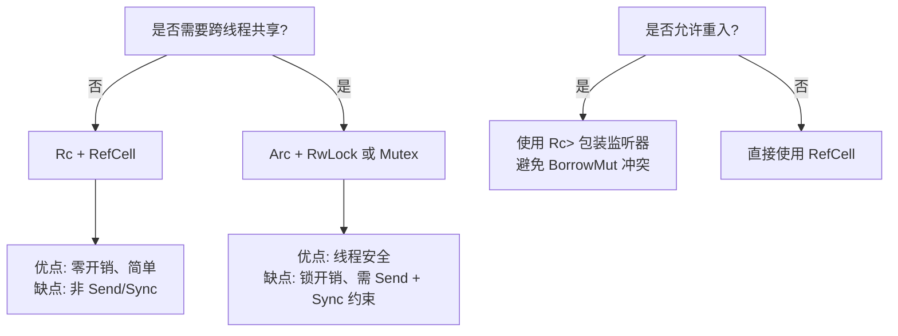
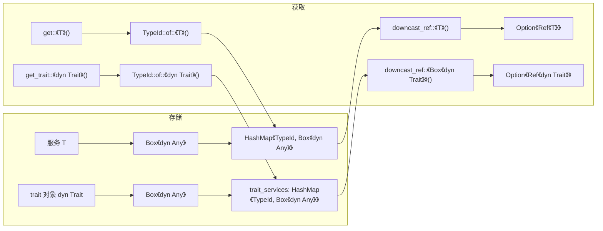
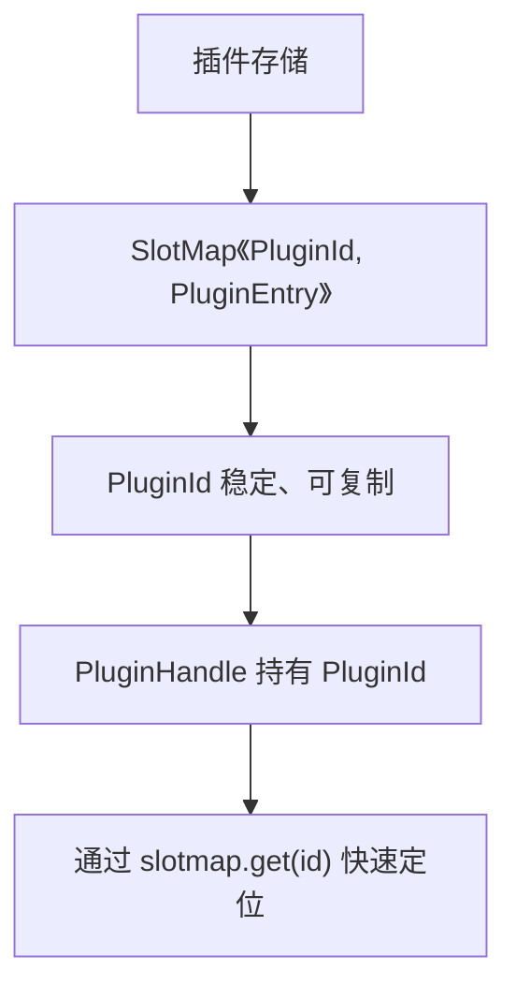
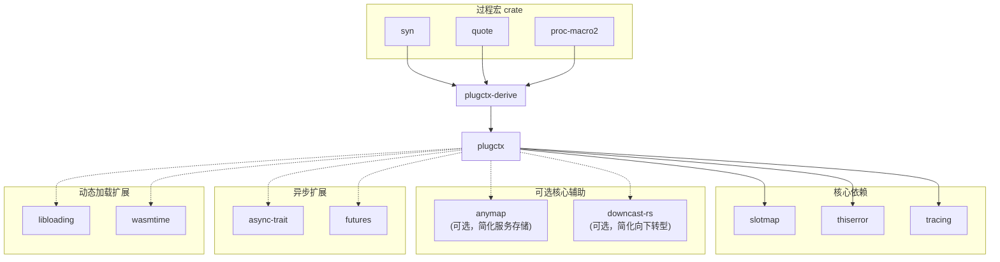
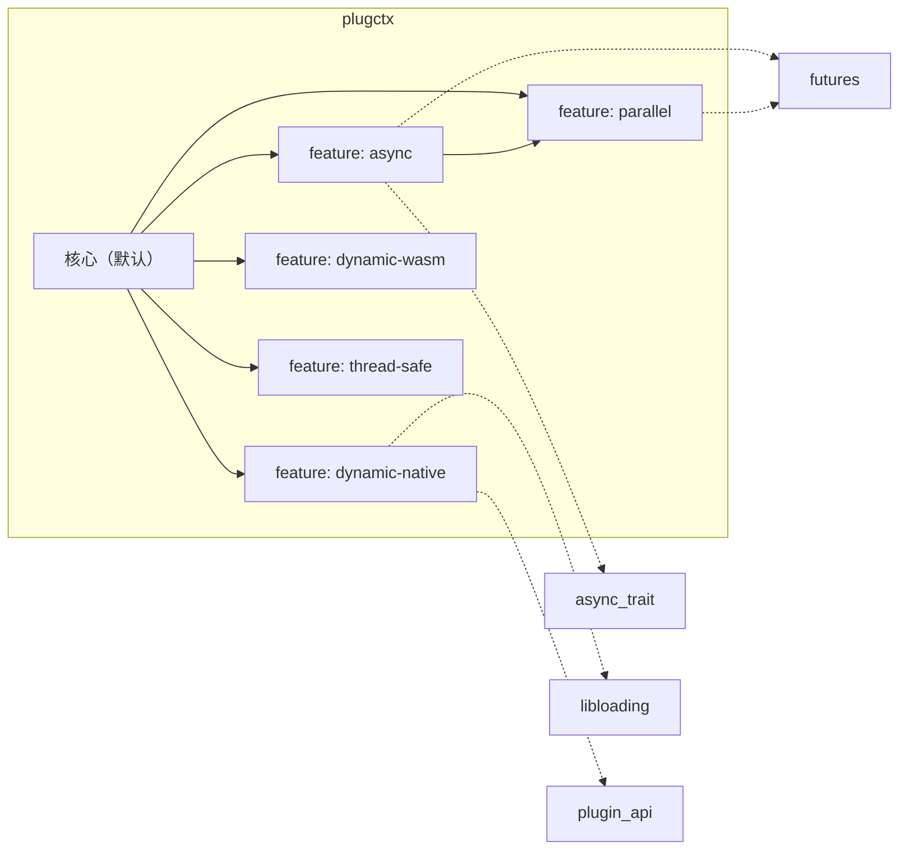
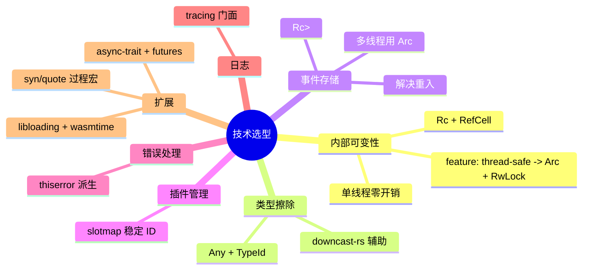

# 7. 技术选型与依赖

## 7. 技术选型与依赖

本章详细说明 `plugctx` 框架在实现层面的技术选型、关键决策依据及外部依赖。所有选择均以**轻量、类型安全、易维护、可扩展**为原则，核心尽量使用标准库，扩展模块按需引入外部 crate。

### 7.1 核心存储与可变性方案

框架核心数据 `ContextData` 需要被多个 `Context` 句柄共享可变访问，并支持重入（事件监听器内部可能再次修改上下文）。存储容器的选择直接影响线程安全、性能和易用性。



**默认选择**：`Rc<RefCell<ContextData>>`

*   单线程环境，零开销。
    
*   `Rc` 共享所有权，`Weak` 实现父子链接避免循环引用。
    
*   `RefCell` 提供运行时借用检查，支持内部可变性。
    
*   事件监听器使用 `Rc<RefCell<dyn FnMut>>` 解决重入（见 7.3）。
    

**多线程扩展**：通过 `thread-safe` feature 将 `Rc<RefCell>` 替换为 `Arc<RwLock>`（或 `Arc<Mutex>`），并要求服务类型、插件类型、监听器类型实现 `Send + Sync`。需同步调整事件监听器存储为 `Arc<Mutex<dyn FnMut + Send + Sync>>`。

### 7.2 类型擦除与向下转型

服务和事件需要存储任意类型，框架采用 `std::any::Any` 进行类型擦除，结合 `TypeId` 作为唯一标识，获取时通过 `downcast_ref` / `downcast_mut` 恢复具体类型。



**依赖选择**：

*   标准库 `Any` + `TypeId` 实现类型擦除。
    
*   `downcast-rs` 提供宏简化向下转型，减少样板代码。但为保持核心最小，也可手动使用 `Any::downcast_ref`。核心不强制引入，但开发时可用。
    

**最终选择**：核心直接使用标准库 `Any`，仅提供便捷方法封装。开发期可选 `downcast-rs` 用于内部实现简化，不暴露给用户。

### 7.3 事件监听器与重入处理

事件监听器以闭包形式存储。若直接存储 `Box<dyn FnMut(&E)>` 在 `RefCell` 中，`emit` 遍历时获取不可变借用，但监听器内部可能调用 `on` 注册新监听器或 `dispose` 卸载插件，需要可变借用，导致 `BorrowMutError`。

**解决方案**：将每个监听器包装在 `Rc<RefCell<dyn FnMut(&E)>>` 中。


*   **注册监听器**：将 `Box<dyn FnMut(&E)>` 放入 `Rc<RefCell<...>>`，然后存入事件列表。
    
*   **触发事件**：克隆整个 `Vec<Rc<...>>`（克隆 `Rc` 成本低），对每个 `Rc` 调用 `borrow_mut()` 执行。
    
*   **重入安全**：监听器内部修改原列表不会影响当前遍历，且 `Rc` 克隆保证监听器在触发期间不被释放。
    
*   **多线程扩展**：`thread-safe` 下替换为 `Arc<Mutex<dyn FnMut + Send + Sync>>`，并克隆 `Arc` 列表。
    

### 7.4 插件 ID 管理

插件需要唯一标识以便 `PluginHandle` 定位。方案有自增计数器、`slotmap` 等。



**选择**：使用 `slotmap` crate 存储插件条目。

*   O(1) 访问、插入、删除。
    
*   ID 稳定且可复用，避免自增计数器无限增长。
    
*   内存紧凑。
    
*   插件 ID 类型为 `SlotMap` 的 `DefaultKey`，无需额外实现。
    

**核心依赖**：`slotmap`。

### 7.5 错误处理

框架所有可能失败的操作返回 `Result<_, Error>`。使用 `thiserror` 派生错误类型，减少样板代码。

```rust
use thiserror::Error;

#[derive(Error, Debug)]
pub enum Error {
    #[error("missing dependency: plugin {plugin:?} requires service {service:?}")]
    MissingDependency { plugin: TypeId, service: TypeId },
    #[error("circular dependency detected among plugins")]
    CircularDependency { plugins: Vec<TypeId> },
    #[error("context already started")]
    AlreadyStarted,
    #[error("context already disposed")]
    AlreadyDisposed,
    #[error("service not found: {type_id:?}")]
    ServiceNotFound { type_id: TypeId },
    #[error("plugin already disposed")]
    PluginAlreadyDisposed,
    #[error("plugin build failed: {0}")]
    BuildFailed(#[from] Box<dyn std::error::Error + Send + Sync>),
}

```

**优点**：

*   自动实现 `Display` 和 `std::error::Error`。
    
*   支持 `#[from]` 自动转换底层错误。
    
*   类型安全、简洁。
    

**核心依赖**：`thiserror`（已接入 `plugctx`；核心变体冻结形态见 `docs/api-freeze.md`，相对下方伪代码多为单元变体）。

### 7.6 日志与诊断

框架内部及插件开发中，日志对调试和监控很重要。选择 `tracing` 作为日志门面。

*   `tracing` 提供结构化日志、span 跟踪，性能开销低。
    
*   与 `log` 兼容，可被各种后端消费（如 `tracing-subscriber`）。
    
*   框架内部关键路径（插件构建、事件触发、effect 清理）使用 `tracing::debug!` 输出诊断信息。
    

**核心依赖**：`tracing`（可通过 feature 关闭，但推荐保留）。

### 7.7 扩展模块依赖

扩展功能按 feature 启用，引入额外依赖。以下列出各扩展模块的依赖和用途。

| 扩展模块 | feature 名称 | 关键依赖 | 用途 |
| --- | --- | --- | --- |
| 异步支持 | `async` | `async-trait`、`futures` | 提供 `AsyncPlugin` trait 和 `start_async` |
| 并行事件 | `parallel`（`=["async"]`） | 复用 `futures` | 提供 `on_async` / `emit_parallel` 宿主侧 `join_all` |
| 原生动态加载 | `dynamic-native` | `libloading`、`plugin-api` | C ABI 加载；逻辑卸载默认不 dlclose |
| 多线程支持 | `thread-safe` | `parking_lot`（optional） | 切换内部存储为 `Arc<RwLock>`，映射守卫供 `get` |
| 过程宏辅助 | 独立 crate `plugctx-derive` | `syn`、`quote`、`proc-macro2` | `#[derive(Plugin)]` 生成 `dependencies` + `on_build` 委托；核心不依赖 |
| 生命周期阶段 | `stages` | 无 | `InitEvent` / `PostStartEvent` / `PreDisposeEvent`（FR32 / §4.7） |

### 7.8 依赖总览图

以下 Mermaid 图展示 `plugctx` crate 的主要依赖及其关系。



**说明**：

*   核心依赖中 `slotmap`、`thiserror`、`tracing` 是必须的（`tracing` 可 feature 控制）。
    
*   `anymap`、`downcast-rs` 为可选辅助，核心可自行实现，不强制引入。
    
*   异步、动态加载的依赖仅在对应 feature 启用时引入。
    
*   `plugctx-derive` 作为独立 crate，依赖 `syn`、`quote`、`proc-macro2`。
    

### 7.9 feature 划分与依赖关系



**feature 说明**：

| Feature | 默认状态 | 依赖 | 说明 |
| --- | --- | --- | --- |
| `async` | 关闭 | `async-trait`, `futures` | 启用异步插件构建 |
| `parallel` | 关闭 | `futures` | 启用并行事件触发，依赖 `async` |
| `dynamic-native` | 关闭 | `libloading`, `plugin-api` | 原生 C ABI 动态库；逻辑卸载 ≠ dlclose；`PLUGIN_ABI_VERSION` |
| `dynamic-wasm` | 关闭 | `extism`（可选） | WASM + Extism + 显式 close；`WASM_ABI_VERSION`；不进默认依赖图 |
| `thread-safe` | 关闭 | `parking_lot` | 将内部存储切换为 `Arc<RwLock>`（映射守卫） |
| `stages` | 关闭 | 无 | `InitEvent` / `PostStartEvent` / `PreDisposeEvent`（FR32） |

所有 feature 均不影响核心 API，只是增加新方法或 trait，保持向后兼容。

### 7.10 技术选型总结



以上技术选型围绕轻量、安全、可扩展的原则，核心保持最小，扩展按需引入，确保框架在各种场景下都能提供良好的开发体验。