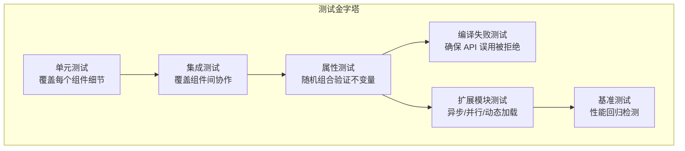
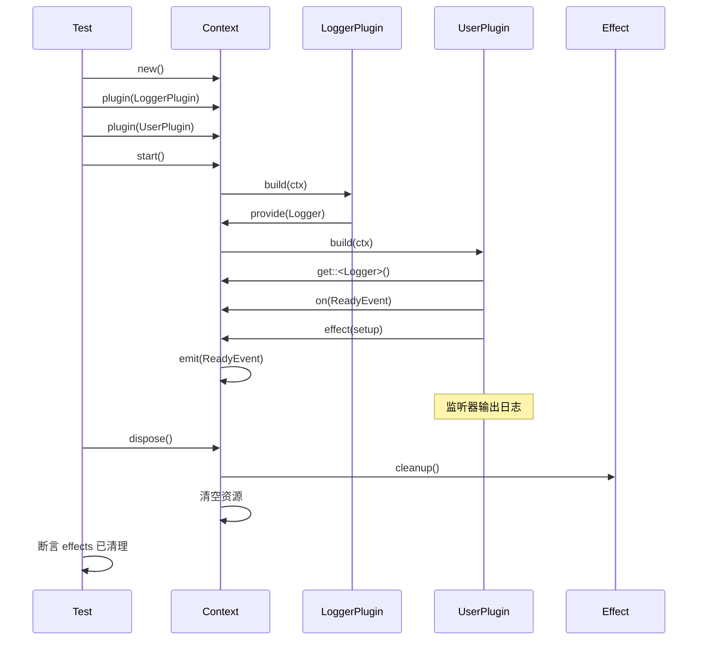
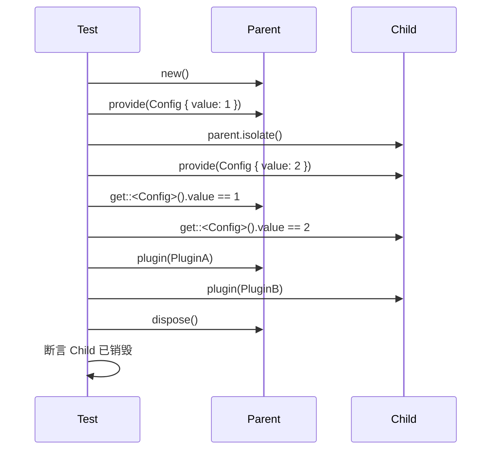
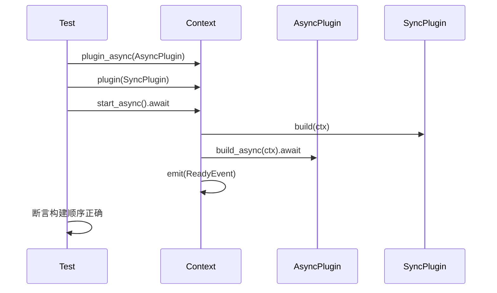
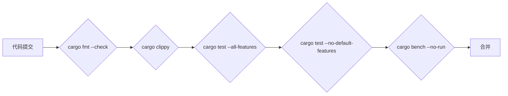

# 8. 测试策略

## 8. 测试策略

本章定义 `plugctx` 框架的测试策略，确保核心功能和扩展模块在多种场景下正确、可靠、无资源泄漏。测试分为单元测试、集成测试、属性测试、编译失败测试、扩展模块测试和基准测试，覆盖从单个组件到完整应用、从同步到异步、从静态到动态加载的各个方面。

### 8.1 测试目标与原则

*   **功能正确性**：插件安装、依赖注入、事件分发、副作用清理等行为符合预期。
    
*   **生命周期完整性**：上下文启动、销毁、插件卸载过程中所有资源被正确释放且仅释放一次。
    
*   **隔离性**：子上下文修改不影响父上下文，父上下文销毁时子上下文级联清理。
    
*   **扩展模块兼容性**：异步构建、并行事件、动态加载等功能在启用时行为正确，不影响核心同步功能。
    
*   **错误处理**：循环依赖、缺失依赖、状态错误等均返回明确错误而非 panic。
    
*   **性能基线**：核心操作（如服务获取、事件触发）保持低开销，扩展模块不引入显著性能退化。
    

### 8.2 测试层次与金字塔

测试按照粒度和依赖关系分层，底层为快速单元测试，顶层为集成和基准测试。扩展模块测试需要单独验证。



*   **单元测试**：数量最多，快速执行，针对单个函数或方法。
    
*   **集成测试**：验证多个组件协作的完整流程。
    
*   **属性测试**：用随机输入验证不变量，增加覆盖广度。
    
*   **编译失败测试**：确保类型系统阻止错误用法。
    
*   **扩展模块测试**：在启用相应 feature 时测试异步、并行、动态加载。
    
*   **基准测试**：监控性能，防止回归。
    

### 8.3 核心功能单元测试

#### 8.3.1 Context 状态管理

| 测试点 | 描述 |
| --- | --- |
| `new()` | 创建后 `is_started()` 和 `is_disposed()` 均为 `false` |
| `start()` | 未启动时启动成功，状态变为 `started`；重复启动返回错误 |
| `dispose()` | 销毁后状态变为 `disposed`；重复销毁幂等且无 panic |
| `isolate()` | 子上下文的 `parent` 弱引用正确；子上下文继承父服务 |

#### 8.3.2 服务管理

*   提供服务后，`get` 返回正确类型引用。
    
*   提供同名服务时，旧服务被返回。
    
*   子上下文可获取父上下文服务。
    
*   子上下文提供同名服务后，子上下文获取到新服务，父上下文获取到旧服务。
    
*   获取不存在服务返回 `None`。
    
*   trait 对象服务：`provide_trait` 和 `get_trait` 正确注册和获取。
    

#### 8.3.3 事件系统

*   注册监听器后，`emit` 按顺序触发所有监听器。
    
*   监听器可修改自身状态（使用 `RefCell` 或闭包捕获）。
    
*   监听器内部触发其他事件不产生借用冲突。
    
*   监听器内部注册新监听器不影响当前触发序列。
    
*   卸载插件后，其注册的监听器被移除。
    

#### 8.3.4 副作用清理（Effect）

*   `effect` 的 setup 立即执行，cleanup 在销毁时执行。
    
*   多个 effects 逆序执行。
    
*   插件卸载时仅执行该插件的 effects。
    
*   上下文销毁后，effects 不再执行。
    

#### 8.3.5 插件作用域与卸载

*   插件构建期间提供的服务，在插件卸载后被移除。
    
*   若同类型服务已被后续插件或根级 `provide` 覆盖，先卸载的插件不得误删当前值（§5.3 / FR33）。
    
*   插件构建期间注册的事件监听器，在插件卸载后不再触发（按索引逆序移除）。
    
*   插件构建期间登记的 effects，卸载时仅执行该插件连续区间并逆序 cleanup。
    
*   插件构建期间创建的子上下文，在插件卸载后被销毁。
    
*   插件卸载后，再次调用其句柄的 `dispose` 返回 `PluginAlreadyDisposed`。
    

#### 8.3.6 依赖排序

*   插件声明依赖某个服务，该服务由另一插件提供，启动时依赖插件在服务插件之后构建。
    
*   缺少依赖服务时，启动返回错误，并指示未构建的插件。
    
*   插件间存在循环依赖时，启动返回错误。
    

#### 8.3.7 拦截器

*   注册拦截器后，插件构建前后拦截器方法被调用；`build` 失败时仅 before、不调 after。
*   事件触发前后拦截器方法被调用；无监听器时仍调用 before/after。
*   拦截器按注册顺序调用（FIFO）；监听器顺序不受影响。
*   子上下文不继承父拦截器；钩子内有限重入不 panic。

### 8.4 集成测试场景

集成测试模拟真实应用场景，验证多个组件协同工作。

#### 8.4.1 完整应用生命周期



测试断言：

*   `Logger` 服务在 `UserPlugin` 构建时已可用。
    
*   `ReadyEvent` 触发时，`UserPlugin` 的监听器执行。
    
*   `dispose` 后，`UserPlugin` 注册的清理闭包被调用。
    

#### 8.4.2 子上下文隔离



#### 8.4.3 插件动态卸载

安装插件并启动后，调用 `PluginHandle::dispose`，验证：

*   该插件提供的服务被移除。
    
*   该插件注册的事件监听器不再响应。
    
*   该插件的 effects 被立即执行清理。
    
*   其他插件的功能不受影响。
    

### 8.5 属性测试策略

属性测试用于验证框架在随机操作序列下的不变量，常见不变量包括：

*   **无泄漏**：经过任意序列的插件安装/卸载/上下文销毁后，所有 effects 均被调用且仅一次（使用计数器验证）。
    
*   **服务隔离**：任何时刻，子上下文对服务的覆盖不影响父上下文。
    
*   **事件顺序**：监听器按注册顺序被调用，即使期间有插件卸载。
    

采用 `proptest` 或 `quickcheck` 生成随机操作：


操作类型示例：

*   安装随机插件
    
*   卸载随机插件
    
*   提供/获取服务
    
*   注册/触发事件
    
*   创建/销毁子上下文
    
*   启动/销毁上下文
    

不变量检查：

*   最终所有资源清理完毕（通过全局计数器统计 effects 执行次数）。
    
*   服务数量等于提供数减去卸载数（考虑覆盖）。
    

### 8.6 编译失败测试

使用 `trybuild` 创建编译失败的用例，确保 API 误用被类型系统阻止。

**目的**：

*   防止 `Plugin::build` 返回错误类型。
    
*   防止在 `Plugin::build` 中获取非 `'static` 服务。
    
*   防止 `PluginHandle` 被复制后重复使用（`dispose` 消耗自身）。
    
*   防止注册非 `'static` 事件类型。
    
*   防止在没有启用 `async` feature 时调用 `start_async` 或 `emit_parallel`。
    

示例 `trybuild` 测试：

```rust
#[test]
fn compile_fail_tests() {
    let t = trybuild::TestCases::new();
    t.compile_fail("tests/compile_fail/*.rs");
}

```

### 8.7 扩展模块测试

扩展模块需在对应 feature 启用时进行测试，验证其行为与核心集成正确。

#### 8.7.1 异步插件测试（`async` feature）

*   异步插件经 `plugin_async` 安装，在 `start_async` 时正确构建，依赖排序仍有效。
    
*   混合同步和异步插件，框架按依赖顺序构建：同步走 `build`，异步走 `build_async`。
    
*   异步构建失败时，`start_async` 返回 `BuildFailed`，不标记 Started，不触发 `ReadyEvent`。
    
*   默认未启用 `async` 时，核心测试与依赖树不含强制异步运行时（NFR1）。
    
*   验收用例：`tests/acceptance_story_3_1.rs`（`required-features = ["async"]`）。
    



#### 8.7.2 并行事件测试（`parallel` feature）

*   `on_async` + `emit_parallel`：多个异步监听器均被调用并全部完成；宿主侧 `join_all` 可重叠（不要求插件内多线程）。
    
*   同步 `emit` 仍按注册序串行，且不调用 `on_async` 监听器（FR8 / NFR5）。
    
*   `cancel` 后异步监听器不再被 `emit_parallel` 调用。
    
*   无异步监听器时 `emit_parallel` 为 `Ok(())` no-op。
    
*   测试使用 `futures::executor::block_on`，不绑定 tokio。
    
*   并行触发不保证完成顺序，但保证全部完成。
    
*   验收用例：`tests/acceptance_story_3_2.rs`（`required-features = ["parallel"]`）。
    

#### 8.7.3 多线程存储测试（`thread-safe` feature）

*   `Context` 在启用 feature 后为 `Send + Sync`，可跨线程 `clone` 后 `provide` /`get` /`emit`。
    
*   多线程并发 `emit` 无数据竞争；同一监听器串行执行。
    
*   默认未启用时仍为 `Rc<RefCell>`，Epic 1–3 验收测试保持原语义（NFR5）。
    
*   验收用例：`tests/acceptance_story_4_1.rs`（`required-features = ["thread-safe"]`）。
    

#### 8.7.4 动态加载测试（`dynamic` feature）

*   动态库插件加载后行为与静态插件一致，支持依赖注入和卸载。
    
*   WASM 插件加载后能正确调用宿主接口。
    
*   加载不存在的文件或非法插件时返回错误。
    

### 8.8 基准测试

使用 `criterion` 对核心操作进行基准测试，建立性能基线。

**基准场景**：

| 操作 | 测试内容 |
| --- | --- |
| 服务获取 | 10 万次 `get` 调用 |
| 事件触发 | 10 万次 `emit`，每个事件 100 个监听器 |
| 插件安装/卸载 | 1000 次插件安装+卸载 |
| 上下文创建/销毁 | 10 万次 `isolate` + `dispose` |
| 异步启动 | 1000 个异步插件的 `start_async` |
| 并行事件 | 100 个监听器的 `emit_parallel` |

基准测试帮助识别意外性能回归，例如 `TypeId` 查找开销、`RefCell` 借用冲突等。

### 8.9 测试自动化

测试应集成到 CI 流水线，每次提交执行：



*   **格式检查**：`cargo fmt --check` 确保代码风格一致。
    
*   **静态检查**：`cargo clippy` 捕获常见错误和性能问题。
    
*   **全量测试**：`cargo test --all-features` 运行所有单元、集成、编译失败测试，包括扩展模块。
    
*   **核心测试**：`cargo test --no-default-features` 确保核心在无扩展时也通过测试。
    
*   **基准编译**：`cargo bench --no-run` 确保基准测试可编译，防止性能测试代码腐化。
    

### 8.10 测试用例示例

以下展示一个单元测试，验证插件卸载后事件监听器不再触发：

```rust
#[test]
fn plugin_unload_removes_event_listener() {
    let ctx = Context::new();

    struct MyEvent;
    struct PluginA;
    impl Plugin for PluginA {
        fn build(&self, ctx: &mut Context) -> Result<(), Error> {
            ctx.on(|_: &MyEvent| {
                // 该监听器应被移除
            });
            Ok(())
        }
    }

    let handle = ctx.plugin(PluginA).unwrap();
    ctx.start().unwrap();

    // 卸载插件
    handle.dispose();

    // 触发事件，不应有任何监听器被执行
    let called = std::cell::Cell::new(false);
    ctx.on(|_: &MyEvent| { called.set(true); });
    ctx.emit(&MyEvent);

    assert!(!called.get(), "已卸载插件的监听器不应被触发");
}

```

### 8.11 总结

测试策略覆盖框架所有层面，从单元测试到基准测试，从核心到扩展，确保功能正确、资源安全、性能稳定。通过属性测试和编译失败测试，进一步提高测试的广度和深度。所有测试自动化运行，保障项目长期可维护性。