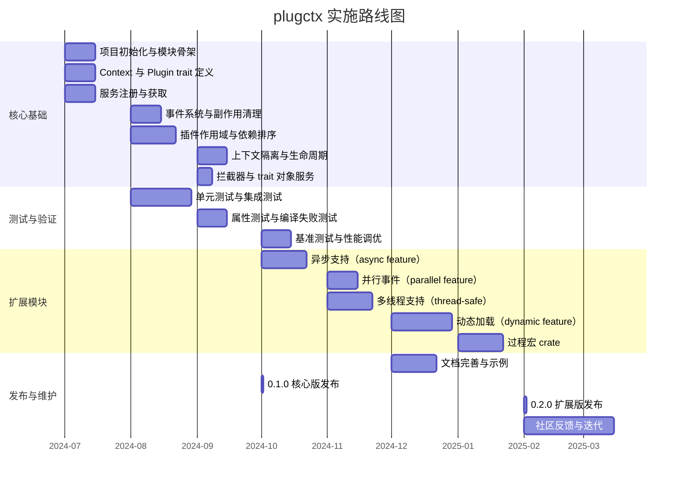
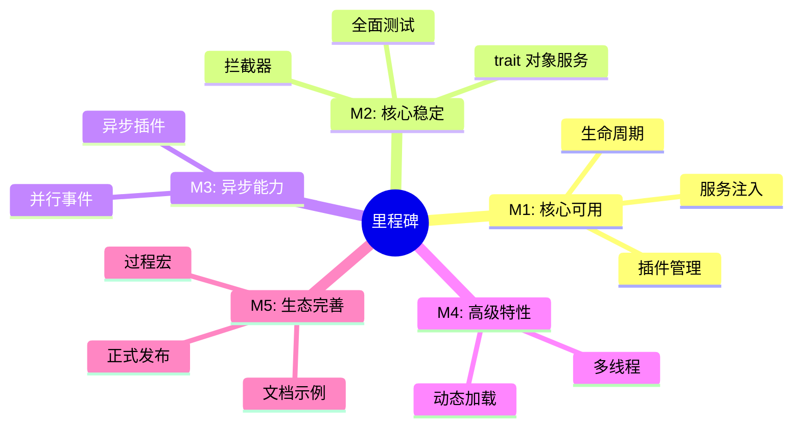

# 9. 实施路线图

## 9. 实施路线图

本章给出 `plugctx` 框架的分阶段实施计划。路线图以**核心先行、扩展跟进**为原则，每个阶段交付可用的功能集合，并通过持续测试保证质量。时间安排为相对估计，可根据实际情况调整。

### 9.1 总体阶段划分

### 9.2 阶段详细说明

#### 阶段 1：核心基础（MVP）

**目标**：实现可用的最小同步插件框架，支持插件安装、服务依赖、事件、副作用和生命周期。

*   **模块骨架**：创建 crate，定义模块结构，搭建 CI。
    
*   **Context 与 Plugin trait**：定义 `Context` 结构体和 `Plugin` trait，实现 `new()`、`plugin()`、`start()`、`dispose()`。
    
*   **服务管理**：实现具体类型服务的 `provide` 和 `get`，基于 `TypeId` 存储。
    
*   **事件系统**：实现 `on` 和 `emit`，使用 `Rc<RefCell<dyn FnMut>>` 处理重入。
    
*   **副作用清理**：实现 `effect`，确保在 `dispose` 时逆序执行。
    
*   **插件作用域**：在插件构建期间记录注册信息，为卸载做准备。
    
*   **依赖排序**：实现乐观构建循环，支持 `dependencies()`。
    
*   **上下文隔离**：实现 `isolate()` 和级联销毁。
    

**交付**：`0.1.0-alpha` 版本，通过核心单元测试。

#### 阶段 2：核心增强与测试

**目标**：完善核心功能，增加拦截器和 trait 对象服务，并建立全面的测试体系。

*   **拦截器**：已落地 `ContextInterceptor` 与 `add_interceptor`（emit 钩子为 `&dyn Any`；build 失败不调 after）。
    
*   **trait 对象服务**：添加 `provide_trait` 和 `get_trait`（已实现；独立 `trait_services` 表，键为 `TypeId::of::<dyn Trait>()`）。
    
*   **单元测试**：覆盖所有核心 API 的正常和异常路径。
    
*   **集成测试**：构建示例应用，验证组件协作；关键路径映射见工作区 [`docs/testing.md`](../testing.md)（Story 5.3）。
    
*   **属性测试**：使用 `proptest` 验证随机操作序列下的不变量（Story 5.5）。
    
*   **编译失败测试**：使用 `trybuild` 确保 API 误用被拒绝（Story 5.6 已交付 ≥3 例；骨架始于 5.3）。
    
*   **基准测试**：建立性能基线（Story 5.7 已交付；`cargo bench -p plugctx --bench core_paths`；CI 仅 `--no-run`）。
    
*   **扩展模块专项测试**：async/parallel/thread-safe/dynamic 矩阵（Story 5.8 / FR41 已交付；`./scripts/ci-extension-matrix.sh`）。
    
*   **回归门禁**：`./scripts/ci-test.sh`（默认 features 门 + trybuild + bench 编译 + `cargo doc` + FR41 扩展矩阵）。
    

**交付**：`0.1.0` 稳定核心版，文档基本完善。

#### 阶段 3：异步与并行扩展

**目标**：引入异步支持，允许异步插件构建和并行事件触发。

*   **async feature**：实现 `AsyncPlugin` trait，使用 `async-trait`；添加 `Context::start_async`。
    
*   **parallel feature**：实现 `Context::emit_parallel`，使用 `futures::join_all`。
    
*   **测试**：针对异步构建和并行事件编写专项测试，确保与同步功能兼容（已纳入 `./scripts/ci-extension-matrix.sh` / FR41）。
    
*   **文档**：说明 feature 使用方法和注意事项。
    

**交付**：`0.2.0-alpha`，包含 `async` 和 `parallel` feature。

#### 阶段 4：多线程与动态加载

**目标**：提供线程安全版本和动态加载插件的能力。

*   **thread-safe feature**：使用 `Arc<RwLock>` 替换内部存储，调整 trait 约束，处理事件监听器的线程安全包装。
    
*   **dynamic-native / dynamic-wasm**：分别落地 C ABI + `libloading` 与 WASM 实例路径；统一 `DynamicLoader` trait（`DylibLoader` / `WasmLoader`）作为扩展入口（FR34）。
    
*   **测试**：多线程下的服务获取和事件触发；动态加载插件的完整生命周期（已纳入 FR41 扩展矩阵）。
    
*   **性能优化**：针对锁竞争和加载开销进行优化。
    

**交付**：`0.2.0-beta`，支持多线程和动态加载。

#### 阶段 5：过程宏与生态完善

**目标**：提升开发体验，完善文档和示例，准备正式发布。

*   **plugctx-derive crate**：实现 `#[derive(Plugin)]` 宏（`#[plugin(depends(...))]` + `on_build` 委托），自动生成依赖列表；独立于核心发布。
    
*   **文档**：编写完整的 API 文档、用户指南和高级示例。
    
*   **示例项目**：提供多个使用场景的示例（CLI、Web 服务、游戏逻辑）。进程内起步示例见 `crates/plugctx/examples/combo.rs`（`cargo run -p plugctx --example combo`，FR29）。
    
*   **社区反馈**：发布 RC 版本，收集 issue 并修复。
    

**交付**：`0.2.0` 正式版，包含所有扩展 feature 和独立 derive crate。

### 9.3 里程碑与优先级

优先级原则：

1.  **核心正确性**高于所有扩展。
    
2.  **同步功能**优先于异步功能。
    
3.  **单线程**优先于多线程。
    
4.  **动态加载**最后实现，因为其复杂度和安全风险最高。
    

### 9.4 风险与应对

| 风险 | 影响 | 应对措施 |
| --- | --- | --- |
| 借用冲突导致运行时 panic | 框架稳定性 | 使用 `Rc<RefCell>` 包装监听器，属性测试覆盖重入场景 |
| 依赖排序算法复杂度 | 启动性能 | 采用乐观构建，减少全局排序开销 |
| 多线程改造破坏 API | 兼容性 | 通过 feature 隔离，单线程默认行为不变 |
| 动态加载 ABI 不稳定 | 运行时错误 | 稳定 C ABI / WASM 宿主 ABI + `PLUGIN_ABI_VERSION`/`WASM_ABI_VERSION` 协商；同工具链锁定；**不以 `abi_stable` 为基线**；返回可诊断错误 |
| 过程宏实现复杂 | 开发进度 | 先提供核心框架，宏作为独立 crate 后续迭代 |

路线图可根据实际开发进度和社区反馈动态调整。核心设计保持稳定，扩展模块按需演进。